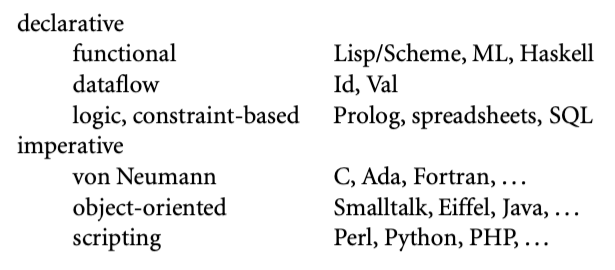

## 编程语言范围

很多现存的语言可以根据计算模型分类。下图展示了一些公共的家族。第一级按照声明式还是命令式分开，声明式表示计算机做什么，命令式表示计算机如何做。



声明式语言某种程度上来说是“更高级别”的语言；它们更符合程序员的观点，而不是实现者观点。但是出于性能问题，命令式语言才是主流。在避免“无关”的实现细节的愿望与尽可能控制算法细节之间声明式语言可以保持张力。毕竟计算机科学的大部分内容是高效算法的设计。我们实际并不清楚对于什么内容，什么问题范围，对于 compiler 需要在高层次问题抽象上发现良好算法。对于 compiler 不能发挥最用的问题领域，开发者需要定制一个。

在声明和命令式家族之下，还有一些子家族：

- 函数式语言采用机遇函数递归定义的计算模型。由 1930 年代的 lambda calculus 演算启发。程序本质上被视作映射输入到输出的函数，这个函数是通过过程定义。本类别的语言有 Lisp, ML, Haskell.
- 数据流语言计算模型是信息在处理节点的信息流动。天然就是并行的：节点被输入触发，然后并行执行。Id Val 是数据流语言。Sisal 是 Val 的后继者，更多的被看作函数式语言。
- Logic or constraint-based 语言从谓词中得到灵感。计算模型是通过目标定向的逻辑规则列表来查找满足某些关系的值。Prolog 是最知名的 logic 语言。这个术语有时候也用于 SQL 数据库语言，XSLT 脚本语言，Excel 编程语言。
- von Neumann 语言（冯 诺伊曼语言）可能是最广泛的语言。包括 Fortran， Ada， C 以及所有通过变量修饰的语言。不同于函数式语言基于 expressions ，冯诺伊曼语言基于 statements，通过改变内存的值来影响一系列计算序列。
- 面向对象语言来源于 Simula 67.更接近冯诺伊曼语言，但是内存和计算更结构化。并没有将计算看作在处理器上的操作，而是抽象为对象之间的交互，每个对象有自身的内部状态和子例程管理状态。Smalltak 是最纯碎的面向对象的语言；C++ 和 Java 应用最广泛。也可以设计面向对象的函数式语言（最知名的是 CLOS 和 OCaml），但是通常它们具有强烈的命令式味道。
- 脚本语言强调“粘合在一起”功能。脚本语言最初因为特定目的被发明出来：csh 和 bash 作为 job control 从 shell； PHP 和 JS 生产动态 web 内容；Lua 用于控制计算机游戏。其他语言，包括Perl，Python，Ruby 更通用。大多数原型开发更偏向开发速度而不是执行速度。

可能会疑问并发语言为什么没有单独分一个家族（事实上本书有一章专门讨论这个话题），但是并行还是顺序执行跟上面的分类是无关的。大多数并发程序是使用库或 compiler 联合顺序语言比如 Fortran 或 C 编写的。一些广泛应用的语言，比如 Java，C#， Ada 具有显式的并发特性。研究人员正在研究每种语言的并发能力。

作为语言家族对比的简单例子，考虑 GCD 问题。冯诺伊曼语言，函数式，logic 语言对于这个问题的表达不仅影响了代码表示，还影响了程序猿的思想。冯诺伊曼语言的算法版本完全是命令式：

> 计算 a 和 b 的 gcd，检查 a 和 b 是否相等。如果相等，打印其中一个，停止。否则选择较大的和差值重复上面的过程。

C 代码如下:

```c
// c code
int gcd(int a, int b) {
  while(a != b) {
    if (a > b) a = a - b;
    else b = b - a;
  }
  return a;
}
```

函数式语言，重点是输出到输入的数学关系：

> a 和 b 的 gcd 定义为：
>
> 1. 当 a = b ，a
> 2. 当 a > b, b 和 a - b 的 gcd
> 3. 当 b > a, a 和 b - a 的 gcd
>
> 当计算 gcd 时，扩展这个定义即可

OCaml 版本如下，let 表示定义；rec 表示递归；函数参数在名字和等号之间

```ocaml
* OCaml code *
let rec gcd a b = 
	if a = b then a
	else if a > b then gcd b (a - b)
	else gcd a (b - 1)
```

Logic 语言，程序员制定一组公理和证明规则，可以让系统发现结果：

> gcd(a,b,g) 的论点是  （1）a,b,g 都相等 （2）a 大于 b，就存在一个 c = a - b 然后 gcd(c,b,g) 为真 ，或者 （3）a 小于 b，就存在 c = b - a 然后 gcd(c, a, g) 为真。为了计算 gcd，搜索 g 满足 gcd(a,b,g) 为真

Prolog 版本的代码如下：

```prolog
% prolog
gcd(A,B,G) :- A = B, G = A
gcd(A,B,G) :- A > B, C is A-B, gcd(C,B,G)
gcd(A,B,G) :- A < B, C is B-A, gcd(C,A,G)
```

应该强调的是语言家族的区分并不明确。例如冯诺伊曼语言和面向对象语言之间的界限很模糊，而且很多脚本语言也是面向对象的。大多数函数式或者 logic 语言包含命令式特性，最近的一些命令式语言包含了函数式特性。上面的描述是为了抓住家族的共有味道，而不是为了提供正式定义。

命令式语言--冯诺伊曼和面向对象--是本书的大部分内容。但是有兴趣的读者可以发现本书的大多数章节的替代计算模型问题涉及了跨家族问题。11-14章包含了函数式，logic，并发和脚本语言。