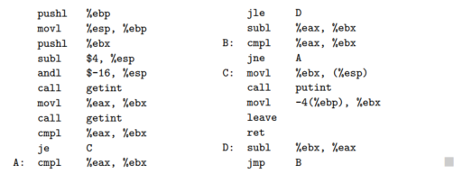

# 介绍

第一台电子计算机非常巨大，占满了几件屋子，耗电巨大，花费了1940年代的巨款（但是计算性能也就现在的手机水平）。使用这种机器的编程人员认为机器的时间比人的更有价值，他们使用机器语言进行编程。机器语言就是比特序列，可以直接控制处理器在适当时间进行加法，比较，移动数据。这种程序的编写是一项无聊且庞大的任务。下面这段程序计算使用欧几里得算法两个整数的公共除数（GCD）。使用机器语言编写，通过16进制数表达的，可以运行在x86指令集处理器。

当人们开始编写大型程序时，显然需要更不易出错的符号集。于是使用容易记忆的缩写的符号的汇编语言被发明。使用汇编编写 GCD 程序如下图：

汇编语言最初被设计为机器指令与方便记忆缩写一对一。将缩写翻译成机器指令的系统程序被称为汇编器（assembler）。Assembler 通过宏扩展的能力允许开发者为常见指令定义参数化的缩写。但是汇编语言和机器语言的关系仍然很明确。编程仍然是以机器为中心：每种不同的计算机有自己的汇编语言，编程人员必须以计算机的方式思考。

随着计算机的进步以及竞争设计的发展，必须为每种新的计算机重写程序让人沮丧。人们也越来越难以记忆汇编语言的大量细节。人们开始希望有一种机器无关的语言，其中数值计算（当时最常见的程序）可以使用类似数学公司的表达。这直接推动了 1950 年代第一门高级语言 Fortran 语言的诞生，随后 Lisp 和 Algo 也随即出现。

将高级语言转换成汇编或者机器码是编译器（compiler）的工作。compiler 比 assembler 要复杂的多，因为不存在源文件到机器指令的一对一关系。Fortran 开始很慢，因为人类总是可以付出一定的努力写出对应的汇编程序，这些程序的运行速度要比 compiler 产生的快。但是随着时间流逝，性能的差距在变小，甚至 compiler 产生的程序更快。由于硬件复杂性的提升（pipeline, multiple functional units 等）和 compiler 技术的改进，compiler 通常会生成比人类写的更好的代码。即使有些场景人类写的更快，机器性能的提升以及程序规模的增大使得这种努力微不足道，因为程序不仅仅写出来就完成工作，还包括了后续的维护，修复和改进，现在人工的成本早就超过了计算机本身。
