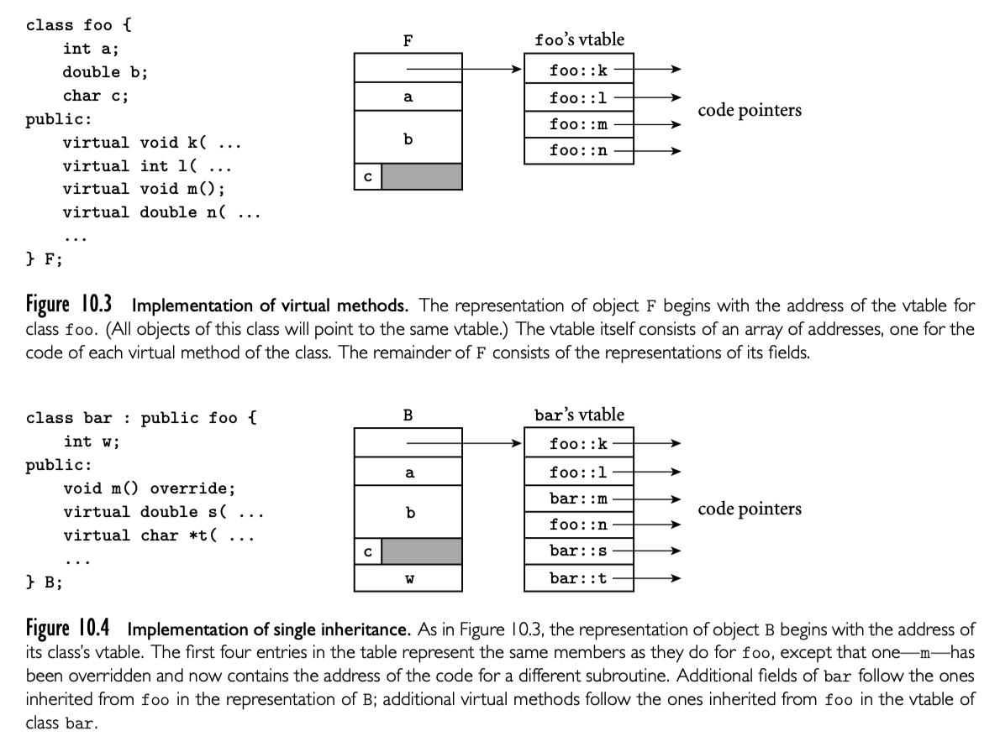
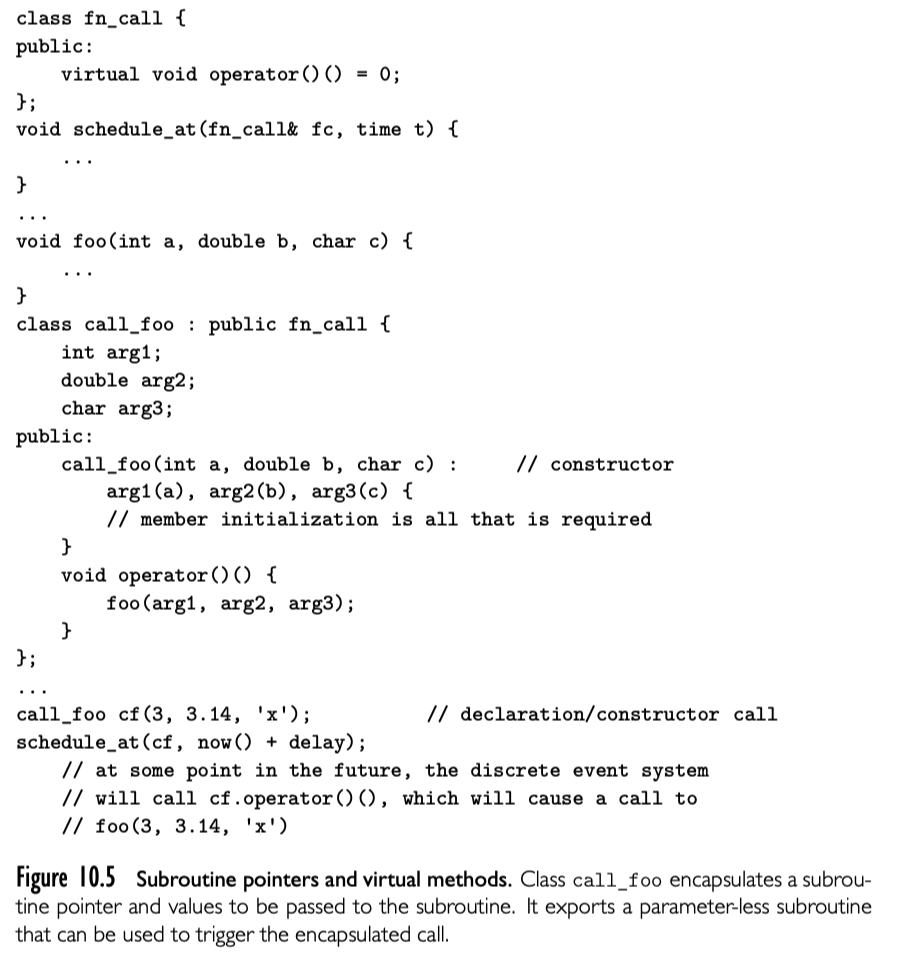

继承的主要后果是派生类拥有了基类所有的成员和方法。这允许派生类用在所有基类可用的地方。换句话说，派生类不隐藏基类成员。

这种在使用基类上下文中使用派生类的能力称为 subtype polymorphism（子类型多态）。想象我们需要一个大学管理员计算系统，我们可以从 person 类中派生 student 和 professor。因为 student 和 professor 都拥有 person 的所有特性。我们可以将它们用在 person 的上下文中

```cpp
student s;
professor p;
...
person *x = &s;
person *y = &p;
```

```cpp
void persion::print_mailing_label() {...}
```

通过参数的类型可以是多态的

```cpp
s.print_mailing_label(); // print_mailing_label(s)
p.print_mailing_label(); // print_mailing_label(p)
```

与其他形式的多态一样，我们取决于以下事实：print_mailing_label 使用实参的特性。

但是假定我们在每个派生类中重新定义了 print_mailing_label 。多态就取决于对象：

```cpp
s.print_mailing_label(); // student::print_mailing_label(s)
p.print_mailing_label(); // professor::print_mailing_label(p)
```

但是，这种情况呢：

```cpp
x->print_mailing_label();
y->print_mailing_label();
```

要调用的方法取决于 x 和 y 的类型？还是指针指向的对象类型？

第一种选项（use the type of the reference）被称为 static method binding。第二种选项（use the class of the object ）被称为 dynamic method binding。动态方法绑定是面向对象编程的核心。

#### 语法和性能

关于静态方法绑定的主要争论----动态方法绑定基于引用对象的类型----静态方法绑定不能体现派生类自身状态的一致性。比如，我们建立一个 I/O 库，包含  text_file 类：

```cpp
class test_file {
  char *name;
  long position; // file pointer
 public:
  void seek(long whence);
  ...
};
```

现在假定我们有派生类 read_ahead_text_file:

```cpp
class read_ahead_text_file: public text_file {
  char *upcoming_characters;
 public:
  void seek(long whence); // redefinition
  ...
};
```

毫无疑问 read_ahead_text_file 的 seek 需要改变 upcoming_characters 的值。如果方法不是动态绑定的，我们不能保证这一点：如果传递 read_ahead_text_file 的引用给 text_file 形参的 subroutine，然后 subroutine 调用了 seek，我们实际调用了基类的 seek。

不幸的是，我们将在 10.4.3 中看到，动态方法绑定引入了运行时开销。即使这种开销通常不大，不过对于性能关键型的小型程序来说，仍然是一个问题。Smalltalk, Objective-C, Python, Ruby 对所有方法使用动态方法绑定。Java Eiffel 默认使用动态方法绑定，但是可以显式声明 final(Java) frozen(Eiffel) 不能在派生类中 override，因此可以优化实现。Simula,C++, C#, Ada 95 默认使用静态方法绑定，但是允许开发者需要时使用动态方法绑定。最后这种情况，需要区分术语，override 是动态方法绑定，redefining 静态方法绑定的方法。为了清楚起见，C# 需要声明关键字 override，new 当派生类需要 override 或者 redefine 方法的时候。Java 和 C++11 也有类似的推荐的注解，但不是必须的。

### 10.4.1 Virtual and Nonvirtual Methods

在 Simula，C++ 和 C# 中，默认使用静态方法绑定，开发者需要对使用动态方法绑定的方法使用 virual 标签。对于 virtual 方法的调用会在运行时调用合适的实现，基于对象的真实类，而不是引用的类型。在 C++ 和 C# 中，virtual 前缀在方法前使用。

Ada 95 使用不同的方式。不将特定的方法与动态分发关联起来，Ada 95 的开发者使用特定引用关联。【译者注： Ada 95 的具体方式请参考原文】

### 10.4.2 Abstract Classes

在大多数面向对象语言中，可能会在基类中忽略 virtual 方法的定义。在 Java 和 C# 中，可以使用 abstract 标签在类上，然后方法也使用 abstract ：

```java
abstract class persion {
  public abstract void print_mailing_label();
}
```

C++ 中没有这么直观：在 subroutine 后面“赋值”为0，表示抽象方法是纯虚函数：

```cpp
class persion {
 public:
  virtual void print_mailing_label() = 0;
}
```

无论声明语法如何，有至少一个抽象方法就是抽象类。不可能实例一个抽象类，因为缺失至少一个成员。抽象类的唯一作用就是作为基类。具体类必须提供抽象方法的重载。基类中抽象方法的存在为动态方法绑定提供了“hook”，允许开发者在调用处使用基类的引用，然后在运行时调用正确的方法。除了抽象方法没有字段成员，没有方法定义在Java， C#， Ada 2005 中称为 interface。支持了“混合”多重继承，我们在 10.5 中讨论。

### 10.4.3 Member Lookup

对于静态方法绑定来说（Simula，C++，C#，Ada 95），编译器总是可以基于变量类型知道那个版本的方法被调用。但是，动态方法绑定需要指针或者引用包含对象足够的信息来让编译器在代码生成时运行时找到正确的方法版本。最常见的实现是在每个对象的第一个位置包含 vtable 的地址。vtable 是一个数组，第 i 个元素表明了对象的第 i 个 virtual 方法。所有实例共享这一个 vtable。



假定 this 指针通过寄存器 r1 保存，m 是 class foo 的第三个方法，f 是指向 foo 的指针。f->m() 就像这样：

```assembly
r1 := f
r2 := *r1 // vtable address
r2 := *(r2 + 3 - 1 * 4) // assuming 4 = sizeof(address)
call *r2
```

如果 bar 继承了 foo，将字段放在后面，然后创建一个新的 vtable 复制 foo 的，然后修改 bar 重载的方法地址以及新增 bar 定义的（如上图）。如果有一个 bar 对象，可以安全将其地址赋值给 foo*。

C++ 允许“向后兼容”赋值，通过 dynamic_cast 运算符

```cpp
s = dynamic_cast<bar*>(q); // performs a run-time check
```

如果运行时检查失败，s 被赋予空指针。为了向后兼容，C++ 也支持 C 风格的类型转换 `s = (bar*)q; // permitted, but risky`，这种风格的类型转换需要开发者确保类型正确：不会执行运行时检查。

Java 和 C# 使用用了传统的类型转换注解，但是会运行时检查。Eiffel 有 ?= 操作符，就像 C++ 的 dynamic_cast。

如同 7.3 所述，Smalltalk 使用“鸭子类型”： 变量是没有类型的引用，可以赋值任何类型的对象。代码真正调用时，语言检查对象是否支持这个操作，如果支持，对象类型就是可接受的。这种实现很简单：对象的字段永远不是 public 的，与对象的交互都由方法来完成。对象的布局开始就是类型描述。类型描述包括一个字典，将方法名称映射到代码段。运行时，Smalltalk 解释器执行查找操作发现方法是不是支持的，如果不支持，生成错误提示--Lisp 风格的。CLOS，Objective-C, Swift, 和面向对象的脚本语言提供类似的语义和类似的实现。动态方法确实比静态方法灵活，但是引入了开销和延迟错误报告。

除了间接增加了开销，virtual 方法通常不能在编译时进行 subroutine 内联展开。而内联的缺失在代码段短小而且被频繁调用时会产生很大的开销。像 C/C++ 尽可能避免运行时开销：因此默认使用静态方法绑定，并且严重依赖对象值变量，这种 virtual 方法也可以在编译器确定。

### 10.4.4 Object Closures

我们已经注意到（在 3.6.4 以及其他地方）对象闭包可以在面向对象语言中实现过程闭包相似的效果--为后续执行方法捕捉上下文。应该注意到，这个机制以来动态方法绑定。举例，将 3.36 适配 9.23 的代码，使用模板重写: 

```cpp
template<typename T>
class un_op {
 public:
  virtual T operator()(T i) const = 0;
};

class plus_x: public un_op<int> {
  const int x;
 public:
  plus_x(int n): x(n) {}
  virtual int operator()(int i) const {return i + x;}
};

void apply_to_A(const un_op<int>& f, int A[], int A_size) {
  int i;
  for (i = 0; i < A_size; i++) A[i] = f(A[i]);
}
...
int A[10];
apply_to_A(plus_x(2), A, 10);
```

任何派生自 `un_op<int>` 的对象都可以传递给 apply_to_A 。因为 operator 是 virtual 的，所以可以“正确”调用。

很多应用有一个有用的惯用法就是包装方法和其参数在对象闭包中方便后续调用。如下示例：



这种技术在 C++11 已经被支持地比较好，可以省略 `fn_call` 和 `call_foo` 的编写。函数 `schedule_at` 可以被定义对象 `std::function<void()>`作为第一个参数，10.5 中的 cf 可以声明为 

```cpp
std::function<void()> cf = std::bind(foo, 3, 3.14, 'x');
```

`bind` 将函数与其参数打包在一起作为对象。标准库还提供了 placehoulder 机制打包部分参数，因此传递给函数对象的参数可以填充到剩余位置。

对象闭包也被用在 Java 中（以及其他语言中），为了封装新创建的控制线程的启动参数（在 13.2.3 中详细介绍）。也可以用来实现访问者模式实现迭代器。