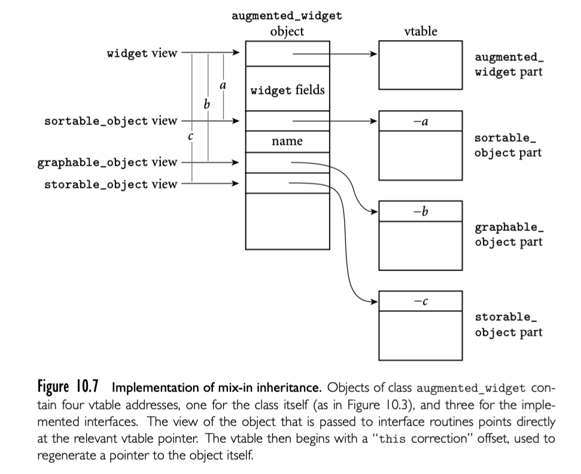

当建立面向对象系统时，通常设计一个完美的继承树（每个类有一个确切的父类）非常困难。cat 可能是 animal, pet, family_member, object_of_affection。widget 在公司数据库中可能是 sortable_object（从上报系统角度）, graphable_object（从窗口系统角度）, 或者 storable_object（从文件系统角度），我们如何选择呢？

通常来说，我们可以想象一个类可以有任意数量的父类，每个父类提供了 field 和 method （抽象或者确定的）。C++，Eiffel，CLOS，OCaml，Python 提供了多重继承来支持，我们在 10.6 中讨论，不幸的是，它引入了大量语义上和运行时的复杂性。实际上，我们更需要的是一种限制性机制，称为混合继承。

比如，考虑 widgets。上报系统需要 widget 可以排序，窗口系统需要 widget 可以展示在屏幕上。为了满足这些需求，提供了混合继承的语言可以让开发者定义对象必须提供的 interface。对于 widget，上报系统可以定义 `sortable_object` 接口，窗口系统可以定义 `graphable_object` 接口，文件系统可以定义 `storable_object` 接口。这些接口不提供具体的实现，widget 设计者需要提供实现。

正如 10.4.2 中所述，接口就是不包含 field 和具体 method 的类。类只继承一个“真正的”父类，然后“混合”实现多个接口。如果 subroutine 参数类型声明为接口类型，实现接口的类都可以作为实参传递。对象也不需要有一个共同的祖先。

最近这些年，混合称为一个通用的方法----可以说是主要方法---来实现多重继承。尽管不同语言的细节不同，但是接口出现在了 Java, C#, Scala, Objective-C, Swift, Go, Ada 2005, Ruby 等语言中。

回到我们的 widget 例子，假定我们已经有了 Java 代码：根据文本部分排序，在 web 浏览器展示，存储在文件数据结构中。每种能力通过接口表达。如果我们已经开发了一些复杂的 widget 一项，我们可以讲接口混合到类中来利用通用代码。【译者注：例子请参考原书】

### 10.5.1 实现

在比如 Ruby，Objective-C, Swift 这些使用动态方法查找的语言中，接口的方法可以简单加入到任何类的方法字典中。在任何需要接口类型的上下文中，查找机制可以找到适当的方法。具有静态类型的语言中，方法的指针被放在 vtable offset 位置，需要新的机制引入。挑战是对一个对象的多种视角。



指针指向对象偏离开始的 offset 被称为 'the correction'，存在 vtable 的开始。

假定现在我们需要调用 augmented_widget 对象 w，它的地址当前在寄存器 r1。编译器知道 w 的 storable_object vtable 指针的偏离，所以可以对 r1 加 c。那么，当调用 storable_object 的 get_stored_name 会发生什么？假定 storable_object 的视角是正确的，在寄存器 r1，编译器会生成类似下面的代码： 

```assembly
r2 := *r1 -- vtable address
r3 := *r2 -- this correction
r3 +:= r1 -- address of w
call *(r2 + 4) -- method address
```

这里我们假定 correction 偏离 vatble 四个字节，get_stored_name 地址就在这里，table 的第一个标准 slot。我们还假定 this 应该通过寄存器 r3 传递，而且没有其他参数。在一个典型的现代机器上，这个代码是 two instructions( a load and a subtraction)。比单继承的所需的代码更长。

### 10.5.2 扩展

上面对于接口的描述反映了 Java 的历史版本，并且省略了一点：除抽象方法外，接口还可以定义 static final field。因为这种 filed 不会再改变，所以没有引入运行时的复杂性和开销-- 编译器可以高效决定它们被使用的方式。

从 Java 8 开始，接口允许 static 和 default 方法，都可以有实现。 static 方法，就像 static final field，没有引入实现的复杂性：不需要访问对象 field，所以视角没有异义（没有 this 参数）。default 方法有点 tricky，这些代码期望在任何对象中被使用，而且不被重载。这个特定对于库作者非常方便：允许新方法加入到已经存在的库接口，而不会影响已经存在的用户代码，否则必须更新才能在接口继承的类中实现新方法。

例如，假定我们要做一个试图将已经存在的代码适配到多种语言和文化的本地化项目。我们希望加入一个新方法

```java
default String get_local_name() {
  return backup_translation(get_stored_name());
}
```

到 storable_object 接口中。提供一个 storable_object 的引用，更新后的用户代码就可以调用新方法了。如果更新后的代码提供了自己的 get_local_name 就调用自己的逻辑，但是如果没有提供，实现了 storable_object 接口的类就会回落到 default 实现。为了使用 default 实现，每个继承了 storable_object 的类需要重新编译，但是用户代码可以保持不变。

因为 default 方法定义在接口声明中，所以只能使用接口的方法和 static field。与此同时，这个方法有又要访问具体实现类的接口方法。在我们的 storable_object 例子中，default 的 get_local_name 可以被发现，调用，get_stored_name 被定义在具体的类中。通常实现这种访问的方法依赖 fowarding routines：对每个继承了 storable_object 的类 C，并且需要 default 方法，编译器生成一个 static C- 特定的 forwarding routine ，它可以访问具体类的 this 参数，将 this correction 加入之后就可以进行常规调用，然后将指向 vtable 指针的指针传递给 default 方法。

事实证明，等效于 default 方法的机制已经被 Scala 语言提供，被称为 traits。事实上，traits 不仅提供了 default 方法，还有可变的 field。不再是通过创建不同视角来直接访问 field， Scala 编译器给每个继承了 traits 的类生成一组隐藏的访问器，类似 C# 的 properties。这些访问器方法的引用包含了特定接口的 vtable，可以被 default 方法调用。在不提供自己定义的 traits 类中，编译器创建一个新的私有 field 提供给访问器使用。

