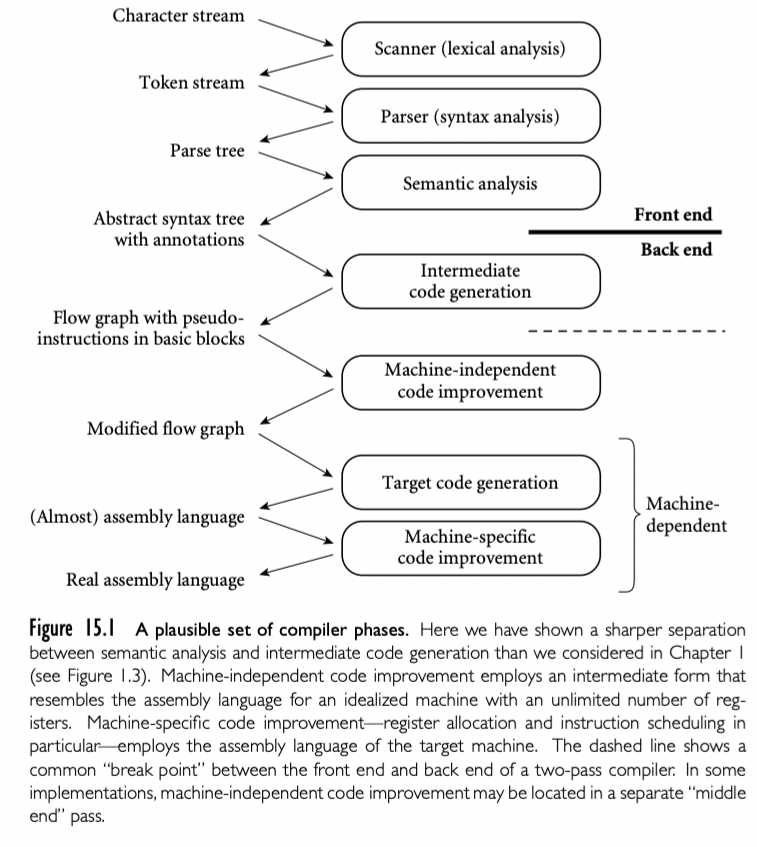

正如我们在第 4 章提到，相对于前端，后端通用的结构更少。即使类似文本处理器，源代码转换，VLSI 布局工具这些编译器也必须有 scan，parse，以及分析语义能力。但是后端，即使同一种语言对于同一种机器也有很多不同的内部结构

我们 15.2 中会看到，不同的编译器使用不同的中间表示来表征程序。它们可能在执行代码优化时使用不同形式。简单的编译器或者以编译速度而不是执行速度的为目标的编译器（比如 JIT）可能根本没有什么改进。JIT 或者“load-and-go“编译器可能不需要单独的 linker。有些编译器，大部分或者全部代码生成器可能是使用工具自动生成，该工具将目标计算机的形式化描述作为输入。

## 15.1.1 A Plausible Set of Phases

