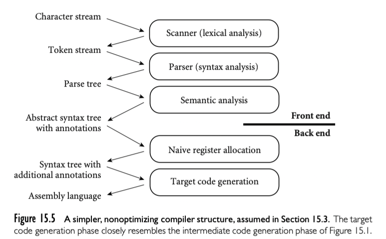

15.1 中的后端结构如此复杂以至于在单独的一章中很难详细描述。为了限制我们讨论的范围，本章我们只讨论生成正确但是简陋的代码。这个选择可以使我们考虑简单点的中端和后端。丢弃机器无关的代码优化部分，然后将中间和目标代码生成合并成一个阶段。

如上图，最后生成汇编语言；因为不进行代码优化改变程序控制结构，所以也就不需要显式表征控制流图。我们也只讨论简单的寄存器分配算法，忽略虚拟寄存器的需要。最后，丢弃指令调度。

## 15.3.1 An Attribute Grammar Example

