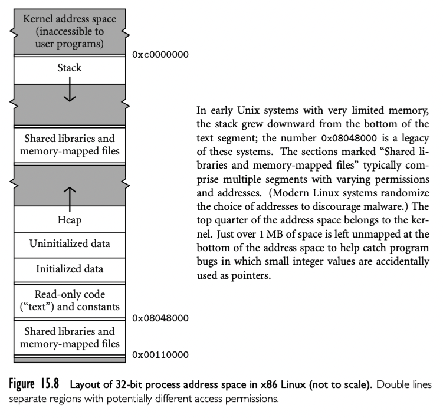

汇编器，链接器，以及加载程序通常以一对相关的文件格式操作：relocatable object 代码和 executable object 代码。可重定位目标代码是链接器的输入；这种格式的多个文件组合称为一个可执行程序。可执行目标代码是加载程序的输入：加载到内存然后运行。可重定位目标文件包括下面的信息：

- Import table：标识命名的位置但是地址未知，不过假定其他文件可以链接到
- Relocation table：标识当前文件的位置，但是必须可以在链接时被修改以反映最终的当前文件（可执行程序）的偏移
- Export table：当前可以被其他文件关联的名字和地址列表

import 和 export 的名字被称为 external symbols

可执行目标文件区别于在于不包含 external symbols（至少对于静态链接的目标而言）。还定义了开始执行的地址。执行文件也可能能被重定位，取决于是否包含了上面的表。

目标文件的结构不同操作系统非常不同。典型的，目标文件被分为几个 section，每个 section 可能被链接器，加载程序或者操作系统处理。第一个 section 包含了 import, export, relocation table，以及表明该程序需要多少空间给没有初始化的 static data。其他 section 通常包括 code (instructions), read-only data(constants, jump tables for case stattements 等)，初始化后的而且可写的 static data，以及 symbol 表和编译器存储的布局信息。初始化描述 section 被链接器和加载程序使用。symbol table section 被调试器和性能探测程序使用。这些表通常不会在运行时加载入内存；运行时也不需要这些表（例外情况是反射机制的程序）。

在可执行格式中，程序被组织成 segment。有些机器上（80826 或者 PA-RISC），segment 对于汇编程序员是可见的，可以被显式命名。不过在现在机器上，segment 只是操作系统以不同方式操作地址空间的一个子集。其中有些--code, constants, 初始化数据-- 可以关联目标文件的 section。code 和 constants 通常是只读的，组合在一个 segment ；操作系统如果发现程序试图修改这些内容就会触发中断。初始化的数据是可写的。在加载期间，操作系统要么从磁盘读 code,constants 和初始化数据，要么在运行时读，以响应“无效访问”（page fault）中断或者动态链接。

除了 code，constants，初始化数据，典型的可运行程序还有几个 segment：

- Uninitialized data: 可能是在加载期间分配或者因为 page fault。通常都是0，提供了没有写入数据的可重复读特性，以及安全性，避免读到之前的数据
- Stack：加载期间分配的固定大小空间。最常见的是，初始大小比较小，操作系统会自动扩大
- Heap：类似栈，在加载期间分配固定大小。最常见的是，初始大小比较下，需要显式扩大
- Files：很多系统，库函数允许程序映射文件到内存中。通过与操作系统交互为文件创建 segment，返回 segment 的起始地址。segment 的内容从磁盘拉取，或者是 page fault 的响应
- Dynamic libraries：现代操作系统通常对于大多数程序共享流行库的单个代码副本。从单个进程的角度来看，这样的库倾向于提供了一对 segment：共享的代码，链接信息。

这些 segment 的布局如下图，是现代 32 位 Linux 系统的排列。对于其他机器或者操作系统可能是不同的。

