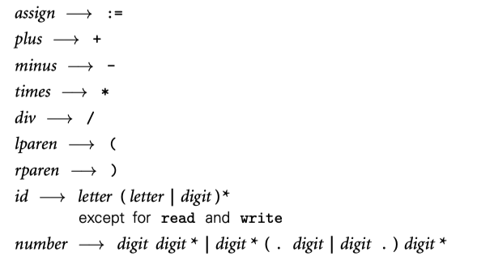
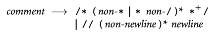
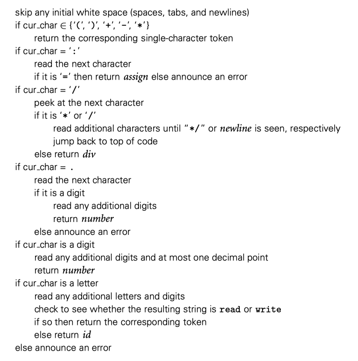

## 2.2 Scanning

scanner 和 parser 联合起来可以用来发现一个程序的句法结构。发现的过程或者称为*syntax analysis*，是将程序转化为目标等效程序的重要第一步。通常来说，本书的剩余部分我们关注编译器而不是解释器。

通过将输入的字符聚合成 tokens，scanner 减少了计算密集型的 parser 必须处理的 item 数量。而且，scanner 会删除注释（因此 parser 不必担心它们在 CFG 中出现）。保存“感兴趣的”tokens 比如 identifier，string，numeric literal，带有行列信息的 tags tokens，方便后续处理中生成更友好的错误信息。我们将会创造一门简单的“计算语言”，有输入，输出，变量和赋值。比如下面的 tokens 定义：

与 Algol 家族保持一致，我们使用 `:=` 而不是 `=`表示赋值。简单起见，我们省略了指数运算符，还列出了 *read* 和 *write* 作为*id*规则。注释的规则如下：

我们如何识别计算器语言的 tokens？最简单的方法是 ad hoc。伪代码如下所示

此代码很容易扩展成需要的逻辑，但是生产级编译器中更多使用自动生成状态机代码，从而方便的改变 tokens 定义，可以自动生成新的 scanner 代码。token 通常使用 “最长匹配原则”。

