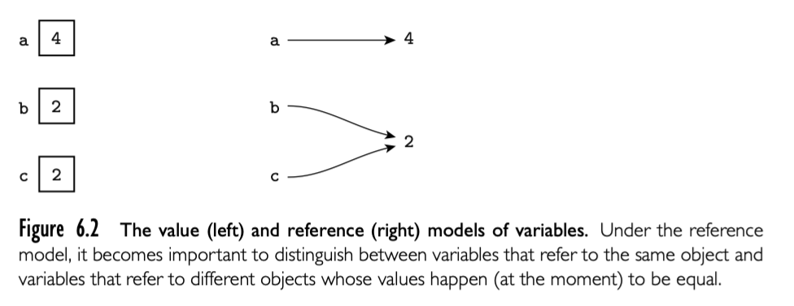
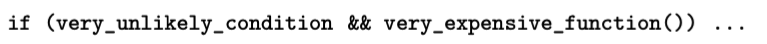

### 6.1.1 Precedence and Associativity

- expression
- statement (side effect)

### 6.1.2 Assignments

- reference or value
  

  ```go
  b := 2
  c := b
  a := b + c
  ```

  reference model **immutable** is important. Reference model every variable is an l-value.

- Boxing

- Orthogonality 正交
  Algol 68 都是 expression
  C 同时使用 expression statement， C 提供了特殊的 expression forms for selection and sequencing. 

- combination assignment operators 
  += ++ -- .eg.

- multiway assignment

### 6.1.3 Initialization

initialization assignment in c++ is different, assigenment should decollate first.

Java and C# 不区分

### 6.1.4 Ordering within Expressions

顺序很重要：

1. side effects: `a-f(b)-c*d`如果 `f(b)`影响 d，这个表达式结果就取决于 f(b) 和 c*d 哪个先执行
2. code improvement: the order of evaluation of subexpressions has an impact on both register allocation and instruction scheduling. 先后顺序影响代码优化，代码优化不会提供哪个先执行的保证，只保证正确性同时尽可能提升运行速度。

所以，大多数编程语言的 order of evaluation of operands and arguments is undefined. 

#### applying mathematical identities

数学交换律，分配律，相关率。但是在计算机中随便重排操作可能会出现 overflow。或者浮点数在计算机中的表示是近似数，同一个表达式，不同顺序的运算可能会导致不同的结果。

### 6.1.5 Short-Circuit Evaluation

boolean expression 提供了特殊而且重要的代码优化方法 -- 短路。



这种形式的计算，可能会节省运行时间。

但是也有不提供短路能力的语言，比如 Pascal 

```Pas
p := my_list
while (p <> nil) and (p^.key <> val) do 
	p := p^.next
```

这种写法就不对，因为两个条件都会执行，就会执行 p = nil 的情况。

但是短路也不总是正面的。比如两个条件 E1 和 E2 都有 side effect， 所以希望同时计算，再判断。有些语言提供了短路和非短路两种选择，比如 Ada 中使用 and / or 表示常规，and then / or else 表示短路。在 C 中，可以使用 &  | 可以作为 && || 的非短路选择。