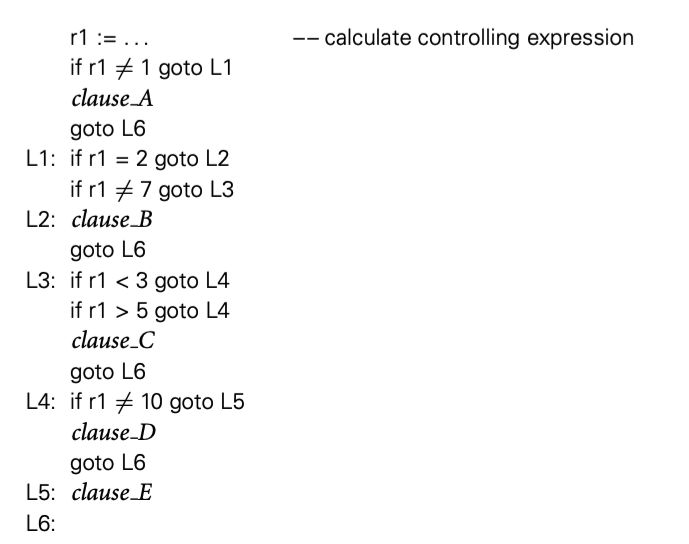
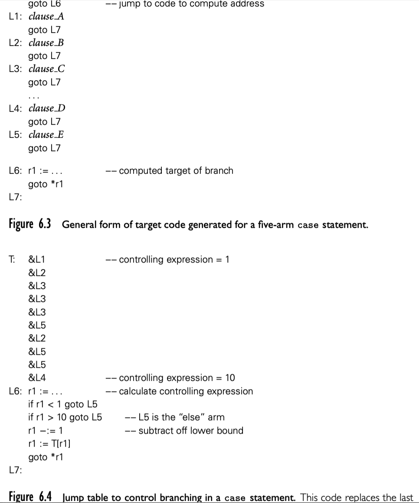

If 语句

### 6.4.1 短路条件

大多数条件语句中的条件不需要存储，所以也不需要参与 register allocation，所以可以生成高效的代码（jump code），而且特别适合 6.1.5 提到的短路。jump code 不仅适用于条件语句，还适合循环，我们在 6.5.5 讨论

在代码生成的一般结果中，由于根表达式的合成属性，最终结果需要寄存器保存，然后上下文使用寄存器名称获得值。在 jump code ，由于根表达式继承属性通知分支。比如，下面代码

```cpp
if ((A > B) and (C > D)) or (E != F) then
  then_clause
else 
  else_clause
```

没有短路计算的语言中，生成的代码如下：

```assembly
r1 := A
r2 := B
r1 := r1 > r2
r2 := C
r3 := D
r2 := r2 > r3
r1 := r1 & r2
r2 := E
r3 := F
r2 := r2 != r3
r1 := r1 | r2
if r1 = 0 goto L2

L1: then_clause
	goto L3
L2: else_clause
L3:
```

jump code 生成的代码如下：

```assembly
r1 := A
r2 := B
if r1 <= r2 goto L4
r1 := C
r2 := D
if r1 > r2 goto L1
L4: r1 := E
		r2 := F
		if r1 = r2 goto L2
L1: then_clause
		goto L3
L2: else clause
L3:
```

布尔值不会显式存在寄存器，而是直接在控制流中使用。

### 6.4.2 case/switch statements

case 语法可以将冗长的 if else 语句简化，但是优化语法写法并不是 case 语句的主要动机。只要动机是生成更高效的目标代码。if else 语句很自然的生成如下代码



不会像 if else 依次计算每个分支条件，case 语句计算条件结果，然后直接使用一条指令跳转到目标分支。



label T 位置的代码实际上是一个 jump 表。L6 的代码检查以确保控制表达式的结果在 jump 表中。

#### Alternative Implementations

jump 表很快，而且节省空间。寻找执行分支的替代技术包括，sequential testing, hashing, binary search。sequential test 类似 if else 语句生成的季过，如果 label 数量较少，可以采用；hash 可以在 O（1） 时间找到，但是 hash table 就像 jump table，要求单独额外的空间存储表，使得不适用于很大范围的 label；binary search 也可以很快找到。

为了 case 语句生成的代码更好，编译器通常要采用混合策略。编译过程会使用内部数据结构描述 label，然后选择采用那种哪种策略。

#### Syntax and Label Semantics

各个语言的 case 语句时不同的，不同的语言使用不同 punctuation 来区分 label 和 arm。更重要的是，语言对于是否支持范围，是否允许默认分支，以及如何处理没有任何匹配的情况。

#### C switch Statement

case 语句在 C（以及 C++ 和 Java）中在几个方面不太常见：

```cpp
switch (.../*controlling expression*/) {
  case 1: clause_A
    break;
  case 2:
  case 7: clause_B
    break;
  case 3:
  case 4:
  case 5: clause_C
    break;
  case 10: clause_D
    break;
  default: clause_E
    break;
}
```

swith 表达式必须是一个值而不能是一个范围。实际上也没有标签列表，但是可以通过允许标签来实现。而且每个分支必须显式使用 break 跳出 switch 语句，否则就会继续执行。通常都要在每个分支加 break，忘记加这是很多奇怪 bug 的来源。C# 继承了 C 家族的语法，但是每个非空分支必须以 goto，continue，break 或者 return 结束。
