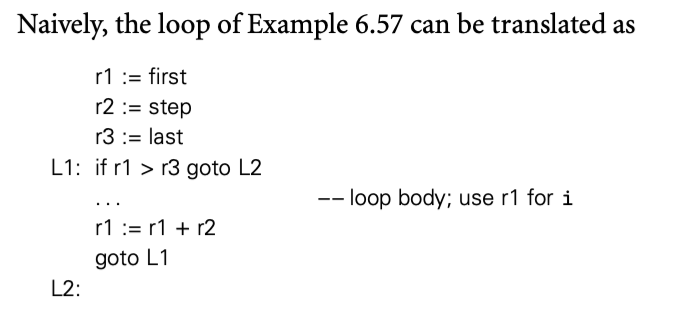
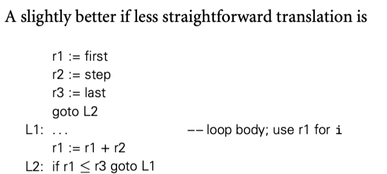
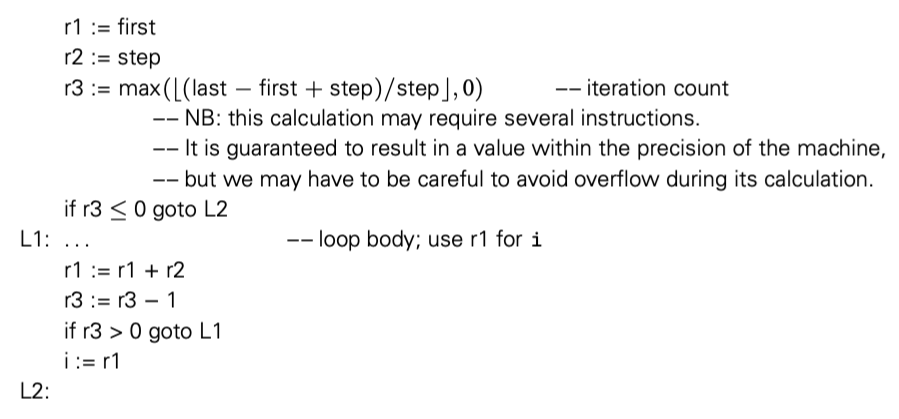
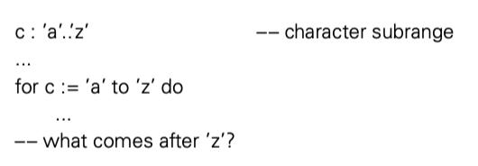
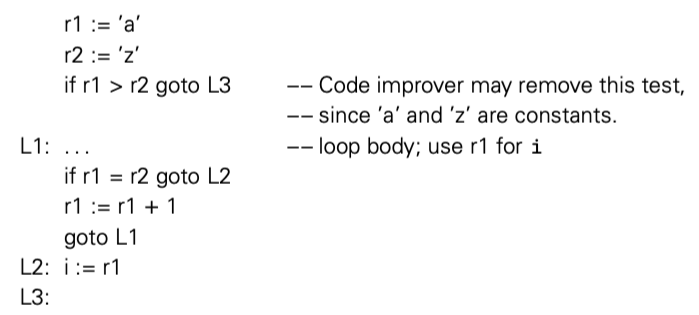

迭代和递归是两种允许计算机重复执行相似操作的机制。如果没有这两种机制，那么程序的文本长度与运行时间就是线性关系。从非常实际的意义上来讲，迭代和递归不仅对固定尺寸的任务有用。本节主要讨论迭代，下一节讨论递归。

命令式语言的开发者更倾向于使用迭代（函数式语言更倾向于递归）。在大多数语言中，迭代使用循环这种格式。就像 statements in a sequence，循环也有 side effects：会影响变量的值。循环主要有两种形式，主要在确定迭代次数上有所不同。enumeration-controlled 循环在有限集上执行，一开始就知道循环次数。logically controlled 循环运行到某些条件达成。大多数语言为这两种循环提供不同的结构。

### 6.5.1 Enumeration-Controlled Loops

Enumeration-controlled 循环首先由 Fortran I 引入 do 循环。几乎后续所有语言都以某种形式支持了这种机制，只是语法上大有不同。即使 Fortran 自己的循环也随着时间发生了很大的变化。现代 Fortran 的版本是这样的：

```fortran
do i = 1, 10, 2
	...
enddo
```

变量 i 在循环中称为 index。等号之后的表达式是 i 的初始值，范围，和步进长度。上面的例子中 i = 1, 3, 5, 7, 9 ，然后结束循环。

很多其他语言提供了类似的机制，在 Modula-2 中是这样

```fortran
FOR i:= first TO last BY step D0
	...
END
```

根据 Clu 的指导，很多现代语言对于 enumeration-controlled 循环走向 iterator 这种更通用的有限集支持--比如在集合容器 tree 的节点。我们在 6.5.3 中讨论这个。现在我们专注于算术序列。

#### Code Generation for `for` loops





下面的版本更快，因为每次迭代只包含了一个条件分支，而不是顶部一个，底部一个两个条件分支。

请注意，这两种都采用了基本上单向的循环结束的测试：假设所有有效 i 小于 last。如果循环向另一个方向：first > last, step < 0 我们需要结尾的测试修改。为了使编译器做出正确的选择，很多语言严格要求算术序列。通常，step 要求是一个编译期常数。Ada 甚至限制必须是正负一。几种语言，比如 Ada 和 Pascal，需要特殊的关键字才能反方向迭代。

显然可以生成在运行时检查步骤正负的代码，并测试。但是要么时间要么空间效率不够。所以更有吸引力的方法，并被很多 Fortran 编译器采用，预计算迭代次数，将次数放到寄存器中，每次迭代结束减一，如果计数不是零就返回循环开始。



循环计数的方法避免了每次循环测试步长符号。假设我们预计算计数时比较谨慎，就可以避免一些算术溢出的问题。

#### Semantic Complications

机智的读者可能已经注意到了迭代次数基本依赖在迭代开始前就计算出来的迭代次数。在很多语言中，这种预测是可行的，比如 Ada 和 Fortran，但是 C 和其后继者中，这种预测不可行。差异的主要原因在于 `for`  循环是用于迭代，还是只是 enumeration 的简单处理？如果语言强调 enumeration，那么迭代次数好计算。如果是通用目的的 loop 循环，更具体的说，是如果迭代次数或 index 在循环执行过程会改变，那么我们需要更通用的实现，处理动态发现的终止条件。

要求仅在几个枚举值之间的选择会有几个问题：

1. 除了通过枚举之外，可以以任何方式进入或者离开循环？
2. 如果循环体修改了循环体结束位置判断是否循环的条件的值会发生什么？
3. 如果循环体修改了 index 会发生什么？
4. 程序是否需要在循环结束之后读 index 的值？如果需要，如何读？

问题1，2解决起来相对简单。大多数语言由 exit 或者 break 关键字提前离开循环。Fortran IV 允许 goto 跳进循环，但是这被看作语言缺陷，在 Fortran 77 中移除了。类似的，大多数语言要求界限只计算一次（C 除外），在第一次迭代之前，然后存为一个临时变量。后续对于界限的修改和计算都没有用。

问题 3，4 更复杂。假设我们这样写

```cpp
for i:= 1 to 10 by 2
  ...
  if i = 3
    i := 6
```

在 i = 3 的迭代之后会发生什么？下一次迭代 i = 5 还是 8，甚至是 7？这都是合理的。为了避免这种问题，很多语言禁止了在循环体中修改 index。Fortran 使得这个规则称为程序员开发规则。

如果通过 exit/break 离开循环体，index 就是当前值。对于正常退出，index 就应该是大于界限的第一个值。不幸的是，如果是整数，可能存在溢出问题。其他类型的循环，可能语义上就是错误的：



要求 index 是最后一个界限值从实现上来说也不合理，生成的代码会变成这样：



当然算术溢出问题可能会干扰测试条件，所以编译器在某些情况必须生成类似代码。为了允许编译在所有情况生成最快的代码，有些语言，比如 Fortran 90 和 Pascal，index 正常结束术语未定义值。

Algol W 和 Algol 68 对于 index 修改和结束后使用问题率先提出了可行的解决方案，然后被 Ada ，Modula 3 和很多语言接受。循环的头部被认为包含了 index 的声明，它的类型从循环界限可以推断，scope 就是循环体。因为 index 不能在循环之外可见，值就不是问题了。

### 6.5.2 Combination Loops

Algol 60 提供了单个循环构造，这个结构包含了更现代的枚举和逻辑控制循环。允许开发者指定特定数量的枚举，每个可以是单个值，一个范围，或者一个终止条件的表达式。Common Lisp 提供了更强大的能力，4个分离部分，初始化 index，测试循环终止条件，循环体，循环体退出的清理。

更简单的形式被 C 和后继者采用，语义上，C 的循环是逻辑控制的。但是从设计上来说，使得枚举变得容易。比如 Mudula-2 的例子：

```Ada
FOR i:= first TO last BY step D0
	...
END
```

用 C 写就是

```c
for (i = first; i <= last; i += step) {
  ...
}
```

等效于

```c
{
  i = first;
  while(i <= last) {
    ...
    i += step;
  }
}
```

这个定义意味着程序员有责任担心溢出对于终止测试条件的影响。也意味着 index 或者用于终止测试的变量都可以被循环体修改，这些会影响循环控制。这些也是程序员的责任。

for 循环中的三个子句任何一个都可以是空的。另外，子句可以使用逗号分隔。C 的 for 循环比 while 循环的优势在于紧凑和清晰。尤其是所有影响循环的变量都在 for 循环头部中写。while 循环中，必须看开始和结尾才能知道结束条件。

虽然 C 循环的逻辑迭代语义消除了 index 在循环体结束后 index 使用的歧义，也使得 index 编程局部变量是方便的，只需要在 for 子句中声明即可。

### 6.5.3 Iterators

在上面的所有例子中，循环的迭代都是通过算术序列。有时候，我们可能想要迭代我们定义的集合上的所有元素。 Clu 引入了优雅的迭代器机制（Python，Ruby 和 C# 也用）。Euclid 和几种更现代的语言，包括 C++，Java 和 Ada 2012 定义了迭代器对象的标准接口，很易用，但是不容易写。Icon 提供了更泛化的迭代器，被称为生成器，结合了枚举和回溯搜索。

#### True Iterators

Clu，Python，Ruby 和 C# 允许容器抽象提供 iterator 方便便利。提供了 yield 。

实际上，一个迭代器就是一个单独的线程控制，有自己的 PC，与 index 关联。迭代器机制可以将需要元素的算法与对于元素的迭代解耦。

#### Iterator Objects

在大多数命令式语言中，迭代器既设计循环的特殊语法，也设计枚举循环的机制。概念被分开了。Euclid， C++，Java 和 Ada 2012 提供了类似枚举控制的机制，类似 Python。没有 yield 语句，没有单独的类似线程的上下文，迭代器就是一个对象，提供了方法来初始化，下一个 index 的生成，测试完成方法。调用之间，迭代器状态由对象自己保持。

【译者注：Java 的略】

C++ 采用了类似 Java 的方式。C++ 需要这样写：

```cpp
tree_node *my_tree = ...
...
for (int n : *my_tree) {
  cout << n << "\n";
}
```

#### Iterating with First-Class Functions

【略】

#### Iterating without Iterators

在既没有 true iterator 也没有 iterator objects 的语言中，我们也可以采用适当的约定来实现算法和迭代的解耦。在 C 中，我们可以定义 tree_iter 类型，然后这样写：

```c
bin_tree *my_tree;
tree_iter ti;
...
for (ti_create(my_tree, &ti); !ti_done(ti); ti_next(&ti)) {
  bin_tree *n = ti_val(ti);
  ...
}
ti_delete(&ti);
```

这个代码和更结构化的方案之间有两个主要区别：（1）循环的语法不够优雅（2）迭代器代码是简单类型有一些关联函数。

### 6.5.4 Generators in Icon

Icon 泛化了 Iterator 的概念，提供了一种机制，可以使得任意表达式按需列举枚举值。

更深入的讨论需要查看[伴侣网站](./assets/supplementary_sections.pdf)

### 6.5.5 Logically Controlled Loops

对比 enumeration-controlled 循环，logically controlled 循环具有更少的语义细节。要回答的唯一问题就是测试终止条件的循环体位置。大多数常见的做法是在每次迭代之前。while 在 Algol-W 中引入：

```cpp
while condition do statement
```

为了使执行体可以包含多个 statement，大多数现代语言使用分隔符，比如 end 隔开，或者大括号。还有少数语言（比如 Python）通过锁进层次来划分执行体。

#### Post-test Loops

有时能够在循环底部测试终止条件很方便。Pascal 提供了特殊的语法，但是 Ada 又抛弃了这个语法。

```pascal
repeat 
	readln(line)
until line[1] = '$';

// vs
readln(line)
while line[1] <> '$' do
	readln(line);
```

当执行体很长的时候，两种结构就不一样了，注意到 post-test 循环至少执行一次。

C 提供了 while 的不同方式来支持 post-test

```cpp
do {
  line = read_line(stdin);
} while(line[0] != '$');
```

#### Mid-test Loops

正如我们在 6.2.1 中描述，有时候在循环中间执行条件测试也是合理的。很多语言中“mid-test”使用循环内部嵌套特殊语句完成：Ada 的 test， C 的 break，Perl 的 last。在 6.4.2 中我们也看到 C 中 break 也可以退出 case 语句。更方便的，C 还用 break 提出最近的 for,while, do 循环。

在有些语言中，exit 语句还可以可选的使用循环标签控制退出的循环，以达到可以退出多层循环的目的。在 Ada 中

```pascal
outer: loop
	get_line(line, length)
	for i in 1..length loop
		exit outer when line(i) = '$';
		consume_char(line(i));
	end loop;
end loop outer;
```

Perl 的 last 也有这种能力。Java 也扩展了 C/C++ 的 break，也支持标签。