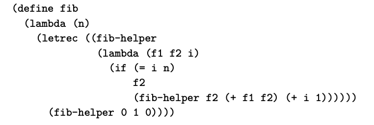

不像已经讨论过的控制流机制，递归不需要特定语法。在任何提供 subroutine 抽象的语言中，只需要可以调用自己，或者调用其他函数（其他函数调用这个函数）就可以。大多数开发者在学习数据结构时了解到递归和迭代提供了等效的能力：任何迭代算法都可以使用递归重写，反之亦然。下面的小节中我们对比递归和迭代。然后考虑传递 unevaluated expression 个i函数的可能性，虽然因为实现开销通常不考虑，但是该技术有时可以让我们为仅在可能的输入子集中定义的函数优雅的代码，或者探索逻辑上无限的数据结构。

### 6.6.1 迭代和递归

正如我们在 3.2 提到，Fortran 77 和当时的其他语言不允许递归。很少有语言不支持迭代。当然，现代编程语言基本两个都支持。迭代在命令式语言中更自然，因为其基于对于变量的重复修改。递归在函数式语言中更自然，因为不改变变量。在最终分析中，使用哪一种看口味以及场景。

求和，迭代很自然，gcd 算法递归更自然。但是这两种都可以用另一种形式实现。

#### Tail Recursion

有时会争论迭代比递归更高效。更精确地说是迭代的常规实现通常比递归的常规实现更高效。在上面的求和和 gcd 例子中，迭代实现确实更高效，因为递归会在运行时创建调用栈来存储局部变量和栈信息。为函数式语言优化的编译器，通常可以为递归生成高效的代码。尾递归函数不需要递归调用：return 值就是递归调用返回。对于这样的函数，动态分配栈空间是不必要的：编译器在递归调用可以直接使用当前栈。事实上，好的编译器会重写

```cpp
// recursive
int gcd(int a, int b) {
  if (a == b) return a;
  else if (a > b) return gcd(a - b, b);
  else return gcd(a, b - a);
}

// ->
int gcd(int a, int b) {
  start:
  if (a == b) return a;
  else if (a > b) {
    a = a - b;
    goto start;
  } else {
    b = b - a;
    goto start;
  }
}
```

通常不是尾递归的代码经过简单的转换就可以成为尾递归。最常见的转换称为 continuation-passing style。实际上，递归函数总是可以通过在递归之后做工作来避免在返回之后做任何工作。

有些特定的转换通常由函数式语言的熟练用户采用。【译者注：请参考原文，译者不熟悉 Scheme 语言】

#### Thinking Recursively

函数式语言的批评者有时会错误的争论，递归会导致算法效率较低的程序。比如，斐波那契数的数学定义就是递归的。如果常规实现，算法是指数复杂度的，同时存在线性复杂度的算法。



当然，Scheme 可以这样写得到 O(n) 复杂度的递归算法。对于习惯函数式编程的开发者这非常自然。有人可能会说，这不是“真正的”递归，这只是把迭代使用尾递归的格式写出来。这个论点有一定可取性。尽管算法类似，但是 C 语言迭代版本和上面尾递归版本有很大的不同：后面这种没有 side effect。每次对于 fib-helper 的调用建立了新的 scope ，包含新的变量。语言实现可以利用先前 scope 的实例，但是要保证互不影响。

### 6.6.2 Applicative- and Normal-Order Evaluation

到目前为止，我们在整个讨论都隐含一个假设，传递给 subroutine 的 expression 都已经完成了计算。这并不总是真的，实际上完全可以传递 unevaluated 的 expression 给 subroutine，然后在需要的时候再计算它。先计算被称为 applicative-order evaluation，后计算被称为 normal-order evaluation。【译者注：这里掠过 normal-order 的一些形式略述】

Algol 60 对于用户定义的函数默认使用 normal-order。大概做出这种选择是为了模仿宏的行为。1960 年代的大多数程序员主要在汇编器中开发，习惯了宏。

#### Lazy Evaluation

从清晰度和效率的角度来看，applicative-order 计算比 normal-order 更可取。在大多数语言中这更自然。但是在某些情况下，normal-order 计算可以获得更快的代码，或者 applicative-order 会导致运行时错误。这两种情况都是，normal-order 的计算可能都不需要执行。支持这种行为提供了 *lazy evaluation* 实现。在没有 side-effect 方面，normal-order 和 lazy evaluation 是同义词，但是实现跟踪已经计算的表达式，所以在同一个 referencing environment 如果需要多次可以重复利用不需要重复计算。

delay expression 有时候称为 promise 。lazy-evaluation 的一个重要应用就是 infinite or lazy 数据结构，这些数据结构可按需“实例”。list 或者 tree 这些数据结构就是例子。

【译者注：无限数据结构在 Rust 中也是比较困难的一个部分，可能跟这里的无限和 Rust 严格的语法有关系，todo 理清楚】