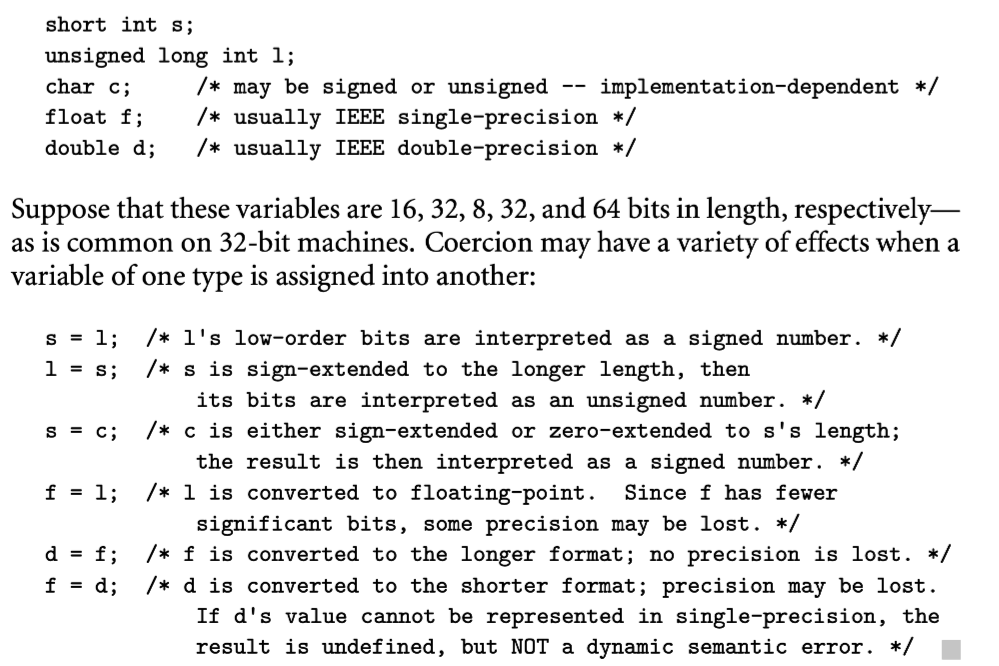
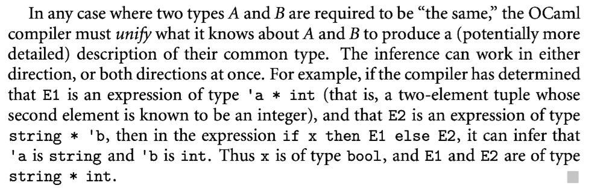

在大多数静态类型语言中，每种对象的定义必须指定对象的类型。此外，从某种意义上说，语言对于对象可以出现在哪些上下文的约束，也规定了上下文中的对象。本节我们讨论 type equivalence, type compatibility, type inference。其中 type compatibility 对于程序员是最重要的。它确定了某个类型的对象可以出现的上下文。至少，如果对象的类型和上下文预期的类型等效，则可以使用该对象。在很多语言中，兼容性比等价性更宽容：对象的类型和上下文期望的类型可以是不同的。我们关于类型兼容的讨论集中于 conversion(也称为 casting)，可以改变一个值的类型；type coercion 就是在上下文中自动执行转换；nonconverting 类型转换就是有时在系统编程中用来解释一种类型的值的位，就好像在表示其他类型的值一样。

当表达式是通过更简单的子表达式构造时，问题出现了：给定子表达式的类型，整个表达式的类型是什么？这个问题的答案由 type inference 解答。类型推导通常是符合直觉的：比如两个整数相加还是整数。当然有些情况比较微妙。类型推导在 ML Miranda Haskell 这些语言中发挥了很重要的作用，其中几乎所有的类型标注都是可选的，编译器可以推导其类型。

## 7.2.1 Type Equivalence

在可以定义新类型的语言中，有两种方式定义类型相同：结构相同（基于类型定义的内容），和名字相同（基于定义的名字）。结构相同在 Algol-68 ，Modula-3 ，C 和 ML 中引入。名字相同出现在 Java，C#，标准 Pascal，Ada 中。

结构相同的具体定义不同语言中是不同的。要决定类型之间那些潜在差异重要哪些不重要。大多数人可能同意声明的格式是重要的，声明中的空格或者空行不重要。比如 Pascal 语言的结构相同：

```pascal
type R1 = record
	a, b: integer
end;

type R2 = record
	a: integer;
	b: integer
end;

type R3 = record
	b: integer;
	a: integer
end;
```

R1 和 R2 应该是相同的，但是 R3 呢？ML 中不相同，大多数语言认为相同。

类似的

```pascal
type str = array [1..10] of char;
type str = array [0..9] of char;
```

这两个类型相同吗？大多数语言认为不相同，但是 Fortran 和 Ada 认为是相同的。

为了判断两个类型是否结构相同，编译器需要递归替换定义中嵌入的类型名称，直到只剩下类型构造函数， 字段名称，和内建类型，如果展开后的字符串相同，类型相同。递归和基于指针的类型可能展开会有点问题，因为展开可能会无限循环，但是这个问题并不是不能解决，在练习 8.15 中有解决方案。

结构相同很直接，但是有时候有点底层，面向实现考虑类型。主要问题是无法区分程序员可能要区分的两种类型，但是内容可能是一样的：

```pascal
type student = record
	name, address: string
	age: integer
	
type school = record
	name, address: string
	age: integer
```

程序员可能想要两种不同的类型，但是编译器会认为这两种类型是相同的，可以互相赋值。

名字相同基于类型定义的名字。假设程序员知道不同类型要使用不同的名字。上面的问题就不会出现。

### Variants of Name Equivalence

名字相同在最简单的类型声明中有些微妙：

```c
type new_type = old_type; // algol family syntax
typedef old_type new_type; // c family syntax
```

`new_type` 被认为是 `old_type` 的别名。我们应该认为两个名字是相同类型吗？还是两个具有相同内容的不同类型？每种语言是不同的。

熟悉 Unix 的用户应该知道文件权限的概念，在 C 中这个权限位定义：

```c
typedef uint16_t mode_t;
```

C 对于标量类型使用结构相同，我们可以想象如果名字相同会出现问题。为了方便使用，权限位类型可以使用基于位的整数操作，就是依赖了 `mode_t uint16_t` 的等效性。

不幸的是，有时候别名类型不应该被认为相同：

```pascal
type celsius_temp = real;
		 fahrenheit_temp = real;
var c : celsius_temp;
		f : fahrenheit_temp;
f := c; (* this should probably be an error *)
```

别名类型不同被称为严格名字相同语言，别名类型相同被称为宽松名字相同语言。大多数 Pascal 家族语言是宽松名字相同语言。Ada 两种都实现了，允许程序员指定别名表示的是 derived 类型还是 subtype。subtype 与基类型兼容，derived 类型不兼容。

思考严格和宽松名字相同的方式之一是区分声明和定义。在严格名字相同的含义，声明 `type A = B` 被认为是定义。在宽松名字相同的含义，只是声明，共享与 B 的定义。

结构相同和名字相同在分离编译实现中都比较困难，我们在 15.6 中回到这个问题。

### Type Conversion and Casts

在静态类型的语言中，某个类型匹配多个上下文期望值。下面的语句：

```go
a := expression
```

我们期待右边表达式的类型与 a 的相同。在表达式`a + b` 中，+ 符号的重载指定要不是整数要不是浮点数；因此我们期望它们要不都是整数，要不都是实数。在 subroutine 调用中

```c
foo(arg1, arg2, ..., argN)
```

我们期望每个参数的类型都是匹配声明的。

假设我们要求期望值和提供值的类型严格相等。程序员在一种上下文中使用其他类型就需要显式转换，取决于涉及的类型，转换可能需要也可能不需要在运行期执行代码。有三个主要案例：

1. 类型在结构上是相同的，但是语言采用名字相同。这种情况下类型之间的底层表示相同，因此转换基本不需要计算，运行时没有开销。
2. 类型有不同集合的值，但是交叉的值使用相同方式表示。类型转换时，运行时必须检查值是否对另一个类型有效，如果检查失败，就抛出错误，检查成功也没有其他开销。有些语言实现允许关闭检查，运行更快但是会出现不安全代码。
3. 类型低层布局不同，但是我们仍然可以定义一些对应关系。比如 32 位整数，可以转换为 IEEE 浮点数的双精度表示。大多数处理器提供了机器码执行这种转换。浮点数也可以 rounding 或者 truncating 转换为整数，但是精度会有所损失，对于很多指数值，转换会溢出。同样很多处理器提供了机器码。

### Nonconverting Type Casts

有时候，尤其是系统编程中，需要在不改变下层实现的时候改变值的类型；换句话说，将一种类型的值的比特解释为另一种类型。一个常见的例子出现在内存分配算法中，使用很大的数组字节表示堆，然后将数组的一部分重新解释为整数，指针，或者用户定义的数据结构。另一个常见的例子出现在高性能数学软件中，可能会将浮点数解释为整数或者 record，指数，有效位数和符号字段。这些字段可以用来实现特定的算法。

类型的改变不会修改低层比特的布局称为 nonconverting type cast, 有时候也称为 type pun.

C++ 继承了 C 的转换机制，但是也提供了语义更清晰的转换代替选择。`static_cast` 执行 type conversion， `reinterpret_cast`执行 nonconverting type cast，`dynamic_cast`允许程序操作多态类型的指针赋值执行运行期检查，而 `static_cast`没有检查。还有一个`const_cast`用来移除只读标志符。

任何 nonconverting 的转换在类型系统中都是危险行为。弱类型系统中，这种转换可能难以找到。强类型系统语言中，显式转换至少表明了代码的危险部分，如果出现问题方便 debug。

## 7.2.2 Type Compatibility

大多数语言不要求上下文期望类型的等效。代替的是，需要兼容。

兼容的定义不同的语言各有不同。Ada 采用了相对严格的方法：类型 S 和类型 T 是兼容的当且仅当（1）S 和 T 是等效的 （2）一个是另一个的 subtype（或者是同一个基类型的 subtype）（3）都是数组，相同类型元素，相同长度。Pascal 稍微放宽了一点：允许基本类型和 sunrange 类型的混合外还允许整数用在实数的上下文中。

### Coercion

当语言允许另一个类型的值用在不同类型期望的上下文中，语言实现必须执行自动隐式的类型转换。这种转换称为 *type coercion*。就像 7.2.1 中提到的显式类型转换，coercion 也需要运行时代码进行动态语义检查或者在低层表示上进行转换。

C 只有相对弱的类型系统，执行了相当多的 coercion。允许大多数数字类型在表达式中混合，并在必要时来回 coercion。



语言设计中 coercion 是一个有争议的话题。因为它允许在程序员没有显式表明意图的时候自动混合类型，这意味着类型系统安全性的削弱。与此同时，有些设计者认为，coercion 是一种支持抽象和程序可扩展性的很自然的方式，从而使新类型与现有类型结合更容易。这种可扩展性的论点在脚本语言中尤其成立，这些语言都是动态类型，并且强调编程语言的易用性。大多数脚本语言对 coercion 支持的很好，尽管也有一些差异：Perl 几乎 coercion 所有东西，Ruby 就更保守。

在静态类型语言中，有更多差异。Ada 除了显式常数，subranges 以及相同元素类型的数据之外不会 coerce 任何东西。Pascal 会在表达式和赋值中 coerce 整数为浮点数。Fortran 在赋值中 coerce 浮点数为整数。C 会执行 coercion 在函数的参数上。

有些编译语言甚至支持 array 和 record 的 coercion。【译者注：忽略一些 Fortran 译者不熟悉语言的描述】C 不支持对于整个数组的操作，但是支持数组和指针的混合；我们在 8.5.1 讨论这种不常见的类型兼容性。Ada 和 C 都不支持 record 的 coercion，除非它们的类型是名字相同的。

C++ 提供了可能是静态类型语言中最极端的 coercion 例子。基于丰富的内建规则，C++ 允许程序员自定义 coercion 操作对于已经存在的类型与新类型。应用这些操作规则以复杂的方式解决与重载的相互作用；给语言增加了巨大的灵活性，但是也是 C++ 最困难正确理解和使用的功能之一。

### Overloading and Coercion

我们已经在 3.5 中提到有时候 overload 和 coercion 有相似的效果。值得在此讨论一下它们的区别。overloaded 的名字可以关联超过一个对象，但是在具体上下文是唯一的。考虑数字类型的相加。在表达式 `a + b` 中，`+` 可能关联了整数和浮点数的相加操作。没有 coercion 的语言中，a 和 b 必须同时是整数或者浮点数，编译器更具操作数类型选择正确的操作符操作。在有 coercion 的语言中，a 或者 b 是浮点数时（另一个整数会 coercion），`+` 就会关联浮点数操作符，只有都是整数才会关联整数 `+` 操作符。可以想象没有定义整数 `+`，但是仍然可以用在整数的上下文，都 coercion 为浮点数。这种方法的问题在于，从整数到浮点数的转换需要不能忽略的时间，尤其是硬件指令不支持的机器上，并且浮点数相加的开销要高很多。

在大多数语言中，字面量（数字，字符串，空集合，或者空指针）可以与很多类型混合使用。通常编译器会有特殊类型检查规则支持这些“常量”类型。

### Universal Reference Types

对于系统编程，或者用于通用目的的容器对象持有其他对象的引用，有些语言提供了通用引用类型。在 C 和 C++ 中，这个类型是 `void *`。在 Clu 中是 `any`，在 Modula-2 中是 `address`，在 Modula-3 中是 `refany`，在 Java 中是 `Object`，在 C# 中是 `object`。

一种确保通用引用特定赋值安全性的方法是让对象是自描述的，在对象的布局中存在一个 tag 表明类型。这个方法在面向对象语言中常用，通常需要用于动态方法绑定。对象中的 type tag 要消耗空间，但是可以防止类型错误的赋值。在 Java 和 C# 中，这种通用到特定的赋值需要类型转换，如果失败会生成一场。在 Eiffel 中，使用特定的赋值操作赋：`?=`，在 C++ 中使用 `dynamic_cast`。

在早期的 Java 和 C# 版本，程序员经常创建持有通用引用的容器。这个惯用法引入 generics 后用得少了，但是还是会用在持有对象不止一种类型的情况。当对象从容器中移除，必须赋值给正确类型的值才能操作。

在没有 type tags 的语言中，这种赋值没有检查：就没有方法运行时确定类型。程序员需要自己保证类型正确。

## 7.2.3 Type Inference

我们已经看到类型检查如何确保表达式组件有正确的类型。但是什么决定了整体表达式的类型呢？在很多情况下这非常简单。算术操作符的结果类型与操作数相同。比较结果类型是布尔类型。函数返回值类型是函数声明中确定的。赋值操作类型相同。但是少数情况下，答案不明显。对 subrange 和复合类型的操作，不一定保留操作数的类型。我们本小节讨论这个问题，讨论 ML，Miranda 和 Haskell 中更复杂的类型推导形式

### Subranges and Sets

对于算术操作符，当操作数有 subrange 类型是，就会发生推导。比如：

```pascal
type Atype = 0..20;
		 Btype = 10..20;
var a: Atype;
		b: Btype;
```

`a + b` 的类型是什么？既不是 Atype 也不是 Btype，因为可能的范围是10..40。可能会想是一个匿名 subrange 类型。常规答案是任意算术操作的结果是 subrange 的基类型--这里是整数型。

如果 subrange 操作后要赋值给一个变量，就需要动态语义检查。为了避免不必要的检查，编译器会在编译时确定 subrange 的范围，本质上就是 10..40 的类型。更复杂的方案可以用在循环中，我们在 C-17.5.2 中详细讨论。

操作集合类型时也会出现类型问题。比如离散集合的 union，intersection，difference 操作。同样的编译器可以跟踪范围避免不必要检查。

### Declarations

Ada 是第一个在 for 循环引入 local 索引变量的。并且不需要程序员指定变量类型，而是将其隐式分配为循环表达式的基类型。

这个思想出现在很多最近的语言中：Scala，C# 3.0，C++11，Go，Swift。比如，C# 中可以这样写

```c#
var i = 123; // int i = 123;
var map = new Dictionary<string, int>(); // Dictionary<string,int> map = new Dictionary<string,int>();
```

这里右边的类型可以用来推导左侧类型，不需要我们显式声明。在 C++ 中可以使用 auto 关键字。

推理的便利性随着声明的复杂性增加而增加。比如

```cpp
auto reduce = [](list<int> L, int f(int, int), int s) {
  for (auto e : L) {
    s = f(e, s);
  }
  return s;
}
...
int sum = reduce(my_list, [](int a, int b) { return a + b;}, 0);
int product = reduce(my_list, [](int a, int b) { return a * b;}, 1);
```

`auto` 简化了

```cpp
int (*reduce) (list<int>, int (*)(int, int), int) = ...
```

事实上，C++ 更进一步，`decltype` 关键字可以用来匹配任何存在的表达式类型。在模板中用的很多，有时候无法提供一个讲台类型名。比如：

```cpp
template<typename A, typename B>
...

A a; B b;
decltype(a + b) sum;
```

这里 sum 的类型就取决于 A 和 B 的类型在 C++ 的 coercion 规则下。如果 A 和 B 都是 int，sum 就是 int。

## 7.2.4 Type Checking in ML

最复杂的类型推导形式发生在 ML 函数式语言家族中，包括 Haskell，F#，OCaml，SML 方言以及 ML 自己。程序员可以像使用传统的静态类型语言一样，显式标注对象的类型，也可以 7.1 中所述一样，不声明确定的对象类型，编译器自动推导。ML 风格的类型推导由语言的创造者 Robin Milner 发明。

推导机制的关键就是当类型系统规定的规则类型必须相同时，两个表达式的（部分）类型信息要统一。这样其中一个就知道了另一个类型信息。任何发现不一致的地方都被定义为静态语义错误。任何类型在推导后还没有确定类型都是多态的；这就是 7.1.2 中说的隐式参数多态。ML 家族的语言还有强大的运行时模式匹配能力和几种非常规的结构类型，包括有序元组，（无序）record，list， 包括 union 和递归类型在内的数据类型机制，以及丰富的继承模块机制和显式参数多态（generics）。我们在 11.4 中详细讨论 ML 类型。

【略：一个 OCaml 的类型推导例子】

在 ML 家族中 type correctness 我们也称为 type consistency：类型检查算法可以给每个表达式推导出唯一一个类型表示程序是正确的。【略：一些关系 ML 家族语言的例子和对于天生参数多态的叙述】

### Type Checking

OCaml 编译器可以通过定义良好的约束验证类型一致性。比如：

- 所有相同的 identifier 有相同的类型
- 在 `if ... then ... else`  表达式中，条件类型是布尔，then 和 else 子句具有相同类型
- 开发者定义的 `'a -> 'b -> ... -> 'r'` 函数，`'a, 'b `等是函数参数的类型，`'r'` 是函数返回值类型
- 当函数被调用，传入的参数类型要匹配函数的定义。



【译者注：图片的例子是很好的说明，但是不好翻译】
