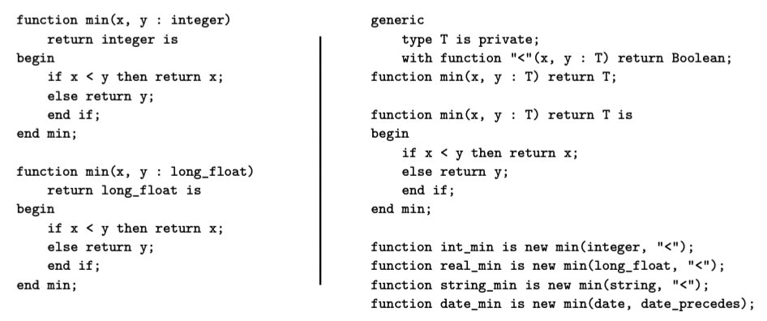
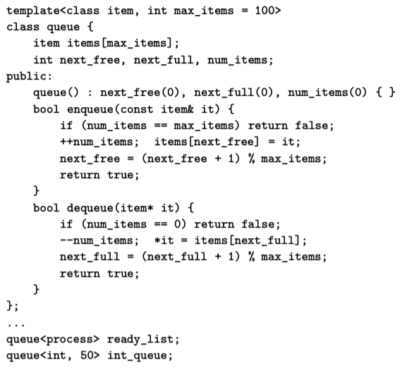
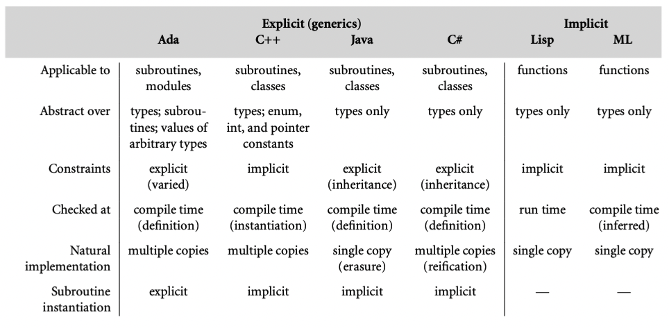

我们在前面的小节已经看到，ML 家族的语言函数都是天生多态的。考虑下面的 OCaml 例子：

```ocaml
let min x y = if x < y then x else y;
```

可以应用于任何类型的参数，尽管有时内置的 `<` 定义不符合程序员的需要。Haskell 中相同的函数可以用于类 Ord 的任何参数；程序员可以通过提供`<`定义给这个类加入新类型【译者注：类似Rust中的 trait 】。强大的类型推导允许OCaml，Haskell编译器在编译期执行大多数类型检查。

在 OCaml 中，我们的`min`函数类型是 `'a->'a->'a`；Haskell 中是`Ord a => a -> a ->a`。显式声明的 x y，我们可以认为是隐式的类型参数。基于这个原因，可以说 ML 家族的语言都提供了隐式参数多态。

如果将类型检查推迟到运行期，没有编译器类型推导的语言也可以提供类似的便利和表达能力。在 Scheme 中，`min`函数可以这样写：

```scheme
(define min (lambda (a b) (if (< a b) a b)))
```

就像在 OCaml 或者 Haskell 中一样，没有提到类型。经典 Scheme 提供解释器在运行期检查。

类似的运行期检查也出现于面向对象语言 Smalltalk，然后在 Object-C,Swift, Ruby中也应用。

这种操作符支持类型（对象是否支持某个方法）的检查有时也称为鸭子类型（duck typing）。源自于“如果叫声和走路都像鸭子，那就是鸭子”。

## 7.3.1 Generic Subroutines and Classes

Scheme，Smalltalk，Ruby 的缺点就是需要运行时检查，提升了开销，推迟了错误抛出。ML 家族语言的隐式参数多态避免了这几个问题，但是需要加强版类型推导。对于其他编译语言，显式参数多态（generics）允许程序员声明 subroutine 或者 class 时指定类型参数。编译器就可以使用这些参数用来静态类型检查。

提供了 generics 的语言有 Ada, C++,Eiffel, Java, C# 和 Scala。下图提供了具体的 subroutine 的例子，对于 Scala 语言，左边是 overload，右边是 generics。



面向对象语言中，generics 也经常被用来参数化整个类。比如容器类：stack, queue, heap, set, dictionary abstractions -> list, array, tree, hash tables。下图就是 C++ 的例子：



缺少 generic 能力的语言（典型的就是 C）中，也有可能定义引用任意类型的 queue，但是需要编译期的类型转换。

我们可以将 generic parameters 看作支持编译期自定义，允许编译器创造特定版本的 subroutine 和 class 实例。有些语言中，比如 Java 和 C#，范型参数必须是类型。有些语言更泛化，比如 Ada 和 C++，范型参数不仅可以是类型，也可以是值，上面的 C++ 例子可以看到整型参数指定队列的最大长度。在 C++ 中，值必须是编译期常数；Ada 中，还支持动态长度的数组，计算推迟到 elaboration time（语义分析阶段）。

### Impelentation Options

Generics 可以通过几种方式实现。Ada 和 C++ 使用纯静态机制：所有创建和使用范型代码的工作都在编译期完成。通常情况下，编译器为每个实例代码创建单独的副本。（C++ 更甚于为每个实例安排类型检查）如果实例化后代码相同，编译器可以共享部分代码。但是并不是必须的，程序员不应该有这种假设。

相反，Java 保证所有范型实例在运行时共享相同代码。事实上，Java 的 T 如果是范型，实际上就是 Object。【译者注：就像是语法糖】C# 使用了中间方式，像 C++，为不同的 primitive 或者 value 类型创建泛化代码的特定实例。像 Java，要求泛化代码自己是类型安全的，不能提供实例化的特定参数。

###  Generic Parameter Constraints

因为 generic 是抽象的，提供了抽象信息的接口就很重要。几种语言，比如 Ada，Java，C#，Scala，OCaml，SML 就试图通过约束范型参数强化这个规则。具体来说，就是要求范型参数类型上的操作必须显式声明。

在 Ada 中，程序员需要通过 with 子句指定范型参数上可以执行的操作。我们看一个简单例子

```ada
generic 
	type T is private;
	type T_array is array (integer range <>) of T;
	with function "<"(a1, a2: T) return boolean;
procedure sort(A: in out T_array);
```

没有 with 子句，sort 过程无法通过比较 A 排序，因为 T 是私有的 -- 只支持赋值，相等测试，和一些标准操作。

Java 和 C# 利用特殊的干净的方法来完成约束，利用面向对象类型的继承父类或者接口的机制。我们在 10 章完整讨论继承。现在，我们注意到 Java 和 C# 允许程序员指定范型参数允许特定的一系列接口，就像 Haskell 的参数类通过隐式多态函数约束类型可接受的参数。在 Java 中可以这样：

```java
public static <T extends Comparabel<T>> void sort(T A[]) {
  ...
  if (A[i].compareTo(A[j]) >= 0) ...
  ...
}
Integer[] myArray = new Integer[50];
sort(myArray);
```

对比 C++ 需要 `template<type_args>` 前缀，Java 将类型参数放在返回值之前。extends 子句表明类型 T 的约束：T 实现了 `Comparable` 接口。编译器就会检查类型是否实现了这个接口，因此保证了编译通过就可以调用 `compareTo` 方法。如果 T 需要实现多个接口可以 `<T extends I1, I2, I3>`，C# 的语法类似，不过使用 where 子句指定约束。

较少的语言不需要显式声明约束，但是还是会检查参数是否可用。比如在 C++ 中，

```cpp
template<typename T>
void sort(T A[], int A_size) {...}
```

没有显式表明 T 需要可以比较。但是如果实例化之后的类型不能使用比较操作符，编译器会报语法错误。不幸的是，由于没有指定范型参数需要什么操作，程序员很难预测会报什么错。更糟糕的是，某些情况下，特定实例化代码操作满足范型代码要求的操作，但是可能无法做“正确的事”。比如 C++ 中，整数和浮点数是符合预期的，但是如果是字符串，就会比较地址，看那个小，如果程序员预期的是逐字符比较，就会出现错误结果。

为了避免这个问题，最好是显式声明约束。下一代版本的 C++（C++20）加入了这个能力。现在程序员可以模仿 Java，放在接口里。

### Implicit Instantiation

因为类就是一种类型，必须在实例化范型类之后才能用。这个 C++ 的声明提供了一种自然的方式：

```cpp
queue<int, 50> *my_queue = new queue<int, 50>();
```

有些语言（比如 Ada）在使用前显式实例：

```ada
procedure int_sort is new sort(integer, int_array, "<");
int_sort(my_array);
```

其他语言，比如 C++，Java，C#，不需要显式声明。代替的是将范型看作重载的一种形式。为了保持语言易于管理，C++ 中的隐式实例化规则比重载规则限制更多。尤其是，编译器不能 coerce 子历程参数来匹配包含范型参数的类型表达式。



这个图总结了 Ada，C++，Java 和 C# 的generics 特性，以及 Lisp 和 ML 的隐式参数多态。[扩展材料](./assets/supplementary_sections.pdf)C-7.3.2 中有更多阐述。

## 7.3.2 Generics in C++, Java and C#

比较 C++ 和 Java 和 C# 对于generic 特性支持可以看到设计中的关键权衡。C++ 是最具雄心的。模板几乎可以完成所有需要相似但不同的抽象机制的编程。Java 和 C# 就更专注于多态。Java 的设计收到向后兼容的严重影响，不仅是语言的版本，还有虚拟机和标准库。C# 设计者虽然以现有语言为基础，但是并没有收到约束，从一开始就计划了 generic，并对 .NET 虚拟机提供了新的支持。

[网站内容](./assets/supplementary_sections.pdf) 中更具体讨论了 C++，Java 和 C# 中的 generics，考虑了不同设计对于错误信息的影响，以及生成代码的速度和数量，以及表达能力的强弱。我们注意到支持 类和方法的 generic 机制和广泛 generic 参数的支持机制非常不同。