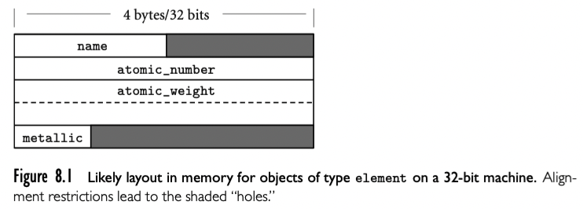
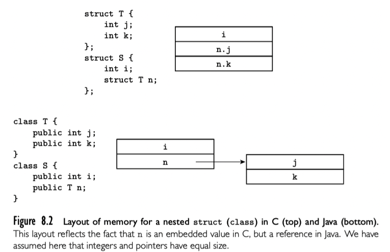
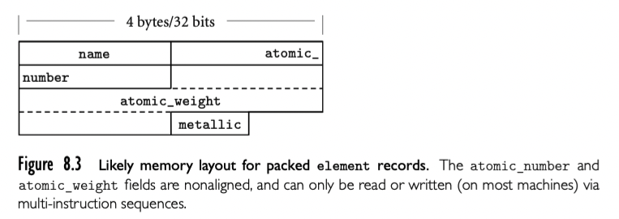
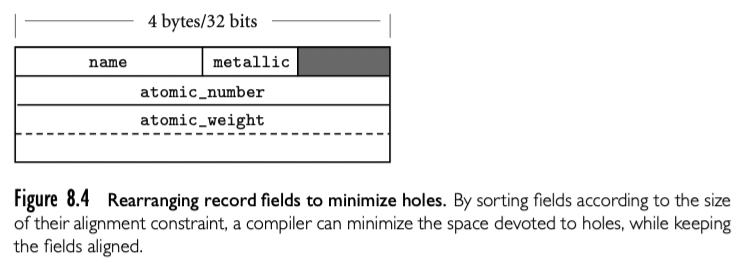

record 类型允许异构类型的相关数据在一起存储操作。最开始由 Cobol 引入，也出现在 Algol 68，称为 structure，并引入关键字 struct。很多现代语言包括 C 以及继承者利用了 Algol 的术语。

## 8.1.1 Syntax and Operations

C，每个组件称为 field（字段），大多数语言使用 . 号访问字段:

```c
struct element {
  char name[2];
  int atomic_number;
  double atomic_weight;
  _Bool metallic;
};
```

大多数语言也支持嵌套，还是用 C

```c
struct ore {
  char name[30];
  struct {
    char name[2];
    int atomic_number;
    double atomic_weight;
    _Bool metallic;
  } element_yielded;
};
// or 
struct ore {
  char name[30];
  struct element element_yielded;
}
```

## 8.1.2 Memory Layout and Its Impact

Record 的 field 通常存储在相邻的内存。symbol 表中，编译器追踪每个 field 的偏移。



32 位机器上的 element 类型如上图。因为 name 字段只有两个字节长。aotmic_number 是个整数，需要字长对齐，所以 name 和 atomic_number 中间有两个字节的“洞”。类似的布尔类型只占用一个比特，也就是一个字节，剩下三个字节的“洞”。所以 element 一个实例需要占用 20 个字节。

值模型的语言中，嵌套 record 通常嵌入到父 record，其中充当带有单字长或者双字长对齐的大字段。在引用模型的语言中，record 类型的字段引用其他位置的数据。主要不同不仅是内存布局上，语义上也很有不同。



如图，C 中采用值模型，Java 采用引用模型。

有些语言和实现允许程序员指定 record 类型 packed。在 Ada 中，可以使用 pragma

```ada
type element = record
...
end;
pragma Pack(element);
```

或者在 C gcc 中使用 attribute

```c
struct __attribute__ ((__packed__)) element {
  
}
```

Ada 是语言内建的，C 的是 gcc 的编译器扩展。无论哪种情况，该指令都要求编译器优化空间而不是速度。通常编译器通过消除“洞”实现 packed record，就是“简单的将字段堆在一起”。为了访问没有对齐的 field，需要使用多指令从内存恢复字段放到寄存器。packed 的 element record 如下图，只使用 15 字节。但是 packed element 数组每个元素要占用 16 字节，因为元素之间要对齐。



对于小的 record，拷贝和比较可以逐字段进行。更大的 record，我们可以使用库函数节省代码空间。比如 `block_copy` routine 可以输入源地址，目标地址和长度作为参数，但是 `block_compare` routine 在“洞”数据不同时会失败。一个解决方案是将所有“洞”数据置为零，但是这样要求 elaboration 点都需要代码。另一个是让编译器为每个 record 生成自定义的逐字段比较的操作。

除了复杂的比较，record 中的洞还浪费空间。pack 消除了洞，但是增加了访问耗时。有些编译器会折中处理，根据长度与字长约束重新排布 record 的字段。字节对齐的字段在前，然后是一半字长的字段，全字长字段，以及双字长的字段。element 重排之后如下图



大多数时候，重排是一个实现问题：语法不受影响，所有的 record 类型实例使用同样的方法重排。系统编程中存在例外，有时会查看数据类型的实现，要求以特殊的方式映射到内存。比如，内核开发者，需要特定的布局策略定义 record 以访问特殊设备的控制寄存器。C 和 C++ 很大一部分是用来设计为系统编程，保证了 struct 的字段以声明好的方式分配。Fortran 90 允许程序员指定不重排字段；不指定就交给编译器自己选择是否重排。为了适应系统编程，C/C++，Ada 允许程序员指定字段占据多少比特。

## 8.1.3 Variant Records（Unions）

C 中

```c
union {
  int i;
  double d;
  _Bool b;
};
```

union 的尺寸是最大元素的大小。

实际上，union 主要有两个目的。第一个是系统编程中，union 允许同样的字节集合在不同时间以不同方式翻译。官方例子出现在内存管理，存储有时候是未分配空间，有时候是 bookkeepting 信息，有时是用户定义类型。虽然可以使用 nonconverting type cast 来做，但是 union 能更好的表明程序员意图：没有重新解释这些位，而是用于独立目的。

第二个是union 的历史目的用来表示 record 中的可代替字段的集合。比如一个员工表示的 record，会有一些公共字段（name, addres, phone, department, ID number）和依赖于这个人薪酬，每小时还是咨询等的其他字段。传统 C union 用于此目的是是丑陋的。更清晰的语法是 Pascal 的 variant records 以及继承者，允许程序员指定 record 的那些字段在内存中应该重叠。C11 和 C++11 也加入了这个形式的 anonymous union。