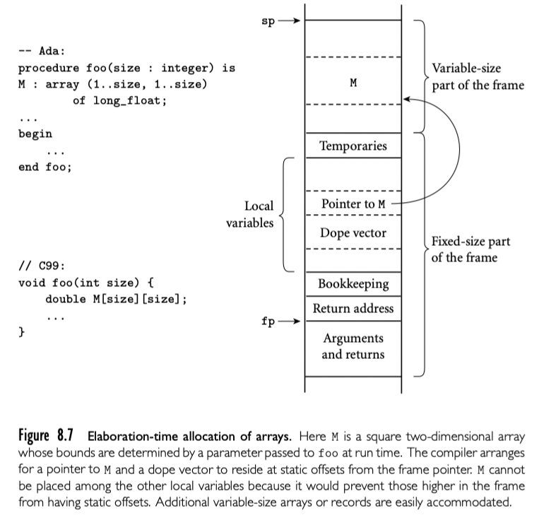
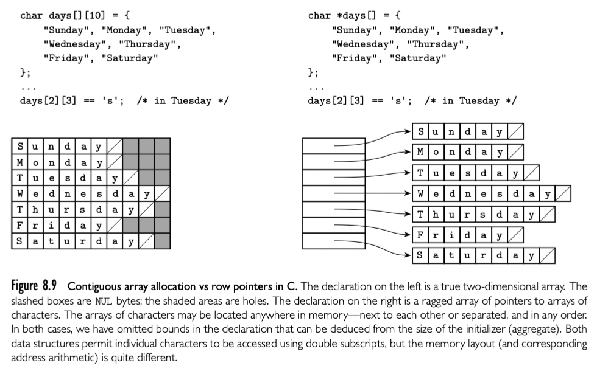

数组是最常见和最重要的复合类型。是很多高层语言基础部分。不像 record 可以将不同类型的字段组织到一起，数组是同构的。语义上，可以被看作 index 类型到 element 类型的映射。有些语言，比如 Fortran 要求 index 类型是整数，很多语言允许是其他离散类型。有些语言，比如 Fortran 77，要求 element 类型是标量。大多数语言，包括 Fortran 90 允许任意类型的 element。

有些语言（通常是脚本语言，以及一些比较新的命令式语言，比如 Go 和 Swift）允许 index 类型不是离散的。导致联合数组必须使用 hash 表或者搜索树实现：我们在 14.4.3 讨论。联合数组也被称为 dictionary 或者 map 类型，被很多面向对象语言通过库支持。在 C++ 中，操作符重载允许 map 使用类似数组的语法访问。本节只讨论离散 index 类型的数组。我们还假设数组是稠密的--其元素的大部分不等于零或者默认值。稀疏数组出现在很多科学问题中，库实现通常使用另一种实现。

## 8.2.1 Syntax and Operations

大多数语言使用方括号。

### Slice and Array Operations

slice 或者 section 是数组的方形一部分。

大多数语言中，只提供访问单个元素的操作和赋值。少数语言，比如 Ada 和 Fortran 90 可以直接比较。

## 8.2.2 Dimensions，Bounds and Allocation

前面的例子中，数组的形状都是声明时指定的。对于这样静态形状的数组，可以常规管理。

存储管理对于直到 elaboration time 或者运行时才知道形状的数组变得更复杂。编译器处理这种情况不仅要分配空间，还要使得形状信息在运行时有效。有些动态类型语言允许运行时绑定 dimensions 的 number 和 bounds。编译型语言可能允许 bound 是动态的，但是要求维度信息是静态的。局部 array ，该 array 在 elaboration time 形状就知道了可以分配在栈上，如果运行时会改变只能分配在堆上。

最后，本小节最后我们讨论 descrptors, 或者叫 dope vector，用来保存运行时的形状信息。然后考虑对于动态形状数组基于栈和基于堆的分配。

### Dope Vectors

编译期，symbol 表建立起了每个数组的 dimension 和 bound 信息。对于每个 record，建立起了每个字段的 offset 信息。number 和每个 array dimension bound 静态的，编译器可以在符号表查找计算元素的地址。不是静态的，编译器必须生成代码在运行时的 dope vector 中查找。

通常 dope vector 必须知道每个 diemension 的低 bound 和每个 diemension 的尺寸。如果语言实现执行动态语义检查，dope vector 也要包含高 bound。

dope vector 的内容在 elaboration time 的时候初始化，或者当 number or bounds of dimensions 修改时。

如果语言同时提供了值模型和动态形状的 record，就必须考虑存在 record 包含了动态尺寸的字段。这种情况，编译器不仅要 dope vector ，还要 dope record。record 的 dope vector 表明了每个字段从起始位置的 offset。

### Stack Allocation

C 和 Ada 支持参数和局部变量都是动态形状的。

```c
void square(int n, double M[n][n]) {
  double T[n][n];
  for (int i = 0; i < n; i ++){
    for (int j = 0; j < n; j++) {
   		double s = 0;
      for (int k = 0; k < n; k++) {
        s += M[i][k] * M[k][j];
      }
      T[i][j] = s;
    }
  }
  for (int i = 0 ; i < n; i++) {
    for (int j = 0; j < n; j++) {
      M[i][j] = T[i][j];
    }
  }
}
```

为了使得每个局部对象可以使用 fp 和 offset 知道，我们将 stack frame 划分fixed-part 和 variable-size part。静态尺寸的对象就在 fixed-part。如果 array 的 elaboration 在嵌套块里，编译器延迟分配空间（就是改变 sp）直到进入块，但是仍然会给指针和 dope vector 分配空间。record 的动态形状也是类似处理。



### Heap Allocation

任意时间都可以改变形状的数组称为全动态数组。因为尺寸的修改不符合 FIFO 顺序，stack 分配不行，全动态数组必须分配在堆。

比如 C++ 中的 vector 类。

## 8.2.3 Memory Layout

大多数语言的数组实现在内存中使用连续的空间。一维数组不用多说。对于多维数组呢？

有两个方式，row-major or column-major。row-major: A[2,4]后一个 A[2,5]。对于 column-major：A[2,4] 后一个 A[3,4]。Fortran 使用 column-major，大多数语言使用 row-major。

两种方式不同在嵌套循环时很重要。现代机器的循环被内存系统性能限制，严重依赖于 cache 的性能。

### Row-Pointer Layout

行指针，不需要内存紧邻。可以每行尺寸不同。



### Address Calculations

比如三维数组，一个元素的访问一般需要三次乘法，6次加减法。可以运行时或者编译时做，这就是实现的权衡了。