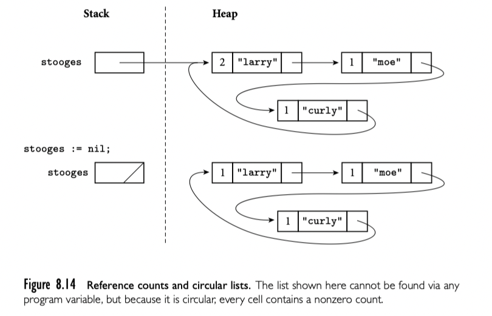
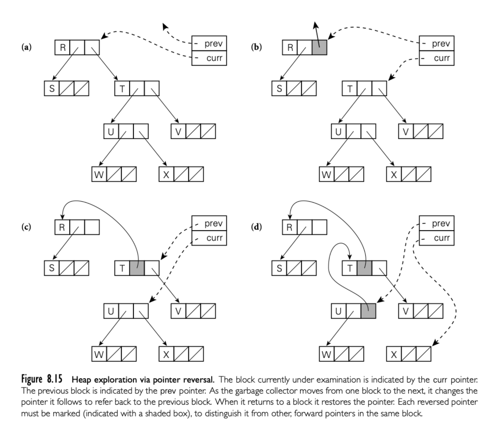

递归类型就是对象包含一个或者多个其他类型的对象的引用。大多数递归类型是 record。递归类型用来建立多种“连接”数据结构，比如 list 或者 tree。

对于允许新对象分配在堆上的语言来说，就有一个问题：如何以及何时将不再使用的对象回收？如果不回收，就会出现“内存泄漏”。如果程序运行很长时间，就没有空间可用了。

有些语言，包括C/C++，Rust 要求程序员显式回收。其他比如 Java，C#，Scala，Go 和所有函数式，脚本语言要求语言实现自动回收。

## 8.5.1 语法和操作

### Reference Model

略

### Value Model

比如 C

```c
struct chr_tree {
  struct chr_tree *left, *right;
  char val;
};
```

依赖 incomplete 类型声明定义递归定义。也没有集成语法创建，只能 node by node 构造。

### Pointers and Arrays in C

指针和数组在 C 中非常接近。

```c
int n;
int *a; // pointer to integer
int b[10]; // array of 10 integers
```

下面的语句都是有效的

```c
a = b;
n = a[3];
n = *(a+3);
n = b[3];
n = *(b+3);
```

大多数上下文中，数组名称被自动转换为数组第一个元素的指针。[] 只是语法糖。

大多数时候 sizeof 运算符是在编译器计算的。主要的例外就是可变长数组 

```c
void f(int len) {
  int A[len]; // sizeof(A) = len * sizeof(int)
}
```

## 8.5.2 Dangling References

当堆内存对象不再存活后，长时间运行的程序需要回收对象的空间。

dangling reference 就是存活的指针，但是指向无效的对象。

## 8.5.3 垃圾收集

显式堆内存回收对于程序员来说非常棘手，也是 bug 的主要来源之一。追踪对象生命周期的代码难以设计实现和维护。另一个吸引人的选择是语言实现对象不再使用，然后自动回收。

自动回收对于函数式语言或多或少是必须的：delete 是非常必要的，从函数构造返回任意数量的对象的能力意味着无限扩展。

随着时间发展，垃圾回收越来越流行。自动垃圾回收很难实现，但是与实现后程序员享受的便利相比，收益很可观。自动收集也比显式回收运行时慢。

### Reference count

何时对象不再使用？一个可能的答案是：没有指针指向它。最简单的垃圾收集技术就是每个对象维护一个计数，记录多少指针指向它。当对象被创建，RC 是1，表示一个指针指向。被赋值，右侧减1，左侧加1。subroutine 返回，epilogue 局部指针指向的对象 RC 减1。RC 为 0，对象要被回收。

为了使得 RC 可以工作，语言实现必须标明每个指针的位置。当 subroutine 返回，必须知道 stack frame 哪个 word 表示指针；当堆上对象被回收，必须知道对象哪个 word 表示指针。标准技术是 type descriptor 由编译器生成。程序的每个类型都有一个描述，每个 subroutine 的 stack frame 加上一个，全局变量也有一个。大多数 descriptor 就是表记录了指针类型的偏移。untagged variant record(C union)，没有可以接受的方案记录。

RC 最重要的问题来自定义“有用的对象”。计数为0表示无用，但是计数不为0也可能无用。比如下面的例子，有循环引用的结构无法 work。



### Smart Pointers

智能指针模拟指针的行为，并且加上额外的语义。

C++ 标准库中提供了很丰富了支持。unique_ptr 顾名思义，如果指针回收，对应的对象也会回收。赋值也会转移所有权（move 语义）。

shared_ptr 实现了引用计数。构造器和析构中加减，赋值（双向）选择加减。如果需要循环结构，需要使用 weak_ptr 不影响引用计数。没有 shared_ptr 就会回收对象，weak_ptr 随之无效。

```cpp
class ClassB;

class ClassA
{
public:
    ClassA() { cout << "ClassA Constructor..." << endl; }
    ~ClassA() { cout << "ClassA Destructor..." << endl; }
    shared_ptr<ClassB> pb;  // 在A中引用B
};

class ClassB
{
public:
    ClassB() { cout << "ClassB Constructor..." << endl; }
    ~ClassB() { cout << "ClassB Destructor..." << endl; }
    shared_ptr<ClassA> pa;  // 在B中引用A
};

// 有问题代码
```

```cpp
class ClassB;

class ClassA
{
public:
    ClassA() { cout << "ClassA Constructor..." << endl; }
    ~ClassA() { cout << "ClassA Destructor..." << endl; }
    weak_ptr<ClassB> pb;  // 在A中引用B
};

class ClassB
{
public:
    ClassB() { cout << "ClassB Constructor..." << endl; }
    ~ClassB() { cout << "ClassB Destructor..." << endl; }
    weak_ptr<ClassA> pa;  // 在B中引用A
};
```

### Tracing Collection

正如我们看到的，引用计数定义了有引用对象才有用。更好的定义是对象有用如果可以通过有名字的东西开始可以达到（访问到）。根据这个定义，上面的循环引用图，从定义上来说，堆中的对象就是无用的。追踪收集器可通过外部指针递归搜索堆，决定什么是有用的。

#### Mark and Sweep

经典标识无用块的机制，更准确的定义被称为 mark-and-sweep。当堆中的空闲空间降低到一个阀值垃圾收集器会进行三步处理：

1. 遍历堆，暂时将每个块标记成无用的
2. 使用堆外的所有指针，收集器递归整个链接的数据，达到的就标记为有用的（有用的也可用来提前终止后续遍历）
3. 收集器再次遍历堆，把仍然标记无用的释放到可用区

这个算法有一些潜在问题。首先，第一步和第三步收集器需要知道使用的块开始和结束。可变堆块语言中，每个块开始必须指明大小，当前是否可用。第二，收集器必须能在第二步发现每个块里的所有指针。标准方案是在每个块的开头存一个指针的 type descriptor 。

#### Pointer Reversal

第二步的搜索是递归的。实现显然需要一个栈最大深度与堆的最长链相同。实际上栈空间可能不足：毕竟，我们在空间快超出才运行垃圾收集！一个搜索的替代实现使用 Schorr 和 Waite 率先提出的技术将等效的栈嵌入到堆块中已经存在字段。具体来说，收集器搜索给定块的路径，反转指针，每个指针指向前一个块，而不是后一个。下图可以说明这个技术。搜索时，收集器记录当前块和从哪里来的块。



d 之后要从 X 回到 U，收集器使用 U 中反转的指针（记录了 T）。会反转这个指针回到 X，然后更新当前块 U。如果返回的块还有其他指针，收集器将会前向处理；否则返回反转的块然后重复。每个块中任何时间最多只有一个反转的指针。指针必须是被标记的，可能通过每个块开始的 bookkeeping 字段。

#### Stop-and-Copy

在很多可变长度堆块的语言中，垃圾收集会通过执行存储合并降低外部碎片。

很多垃圾收集器利用 stop-and-copy 技术达成合并同时消除标准 mark-and-sweep 算法中的步骤1和3。具体来说，将堆分为两个大小的区域。所有分配发生在前一半，当这一半满了，收集器开始搜索可达的数据结构。每个可达块复制到第二块区域没有外部碎片。第一个区域的老版本块使用有用 flag 标记然后指向新的区域。任何指向相同位置的指针（后续搜索到的）都指向新块。收集器完成了搜索，所有有用的块都被移动到第二个区域，第一个区域可以全部清理，然后反转两个区域的概念。显然，这个算法的问题就是空间利用率不行，只使用了一半的空间，不过在虚拟内存系统中，每个堆的一半空间已经足够占满物理空间了。此外，通过消除 mark-and-sweep 的步骤1，3，stop-and-copy 开销只与不需要回收块的数量成正比，而不是所有块。

#### Generational Collection

为了进一步降低记录开销，有些垃圾收集器利用了“代”技术，利用了观察到的一个现象，大多数动态分配的对象生命期很短。堆分为多个区域（经常是两个）。当空间不足，收集器首先检查年轻的区域，假设有高比例的垃圾。只有在这个区域无法回收足够的空间，才检查老的区域。为了在运行时长很长的程序中避免泄漏，收集器必须准备好如果必要，检查整个堆。然而大多数时候，开销只与年轻区域有关。

任何年轻区域检查还存活的对象移动到老的区域，类似 stop-and-copy。

#### Conservative Collection（保守收集）

语言实现者假定自动垃圾收集只出现在强类型语言中：RC 和追踪收集要求我们找到对象的指针。如果我们承认某些垃圾无法获得的可能性，事实证明，我们可以无需找到指针的 mark-and-sweep。关键是基于一个观察，堆中给定的块中是地址的数量非常少。只有很小的概率内存的一些字不是指针但是出现了像地址的位模式。

如果我们假定，保守来看，堆块中出现的每个指针都是有效的，我们可以使用 mark-and-sweep 处理了。当空间变小，收集器暂时标记所有为无用。按照字长扫描栈和全局存储。如果任何字看起来像是堆中地址，收集器标注此地址是有用的。递归的，收集器按照字长扫描堆中的块，标记有用的。

这个算法是完全安全的（不会回收有用的块）只要开发者不“隐藏”指针。比如存储指针，转成 int 类型然后异或操作过，使用时需要计算恢复出来。除了有些垃圾不会被回收，这个方法也不能执行 compaction。