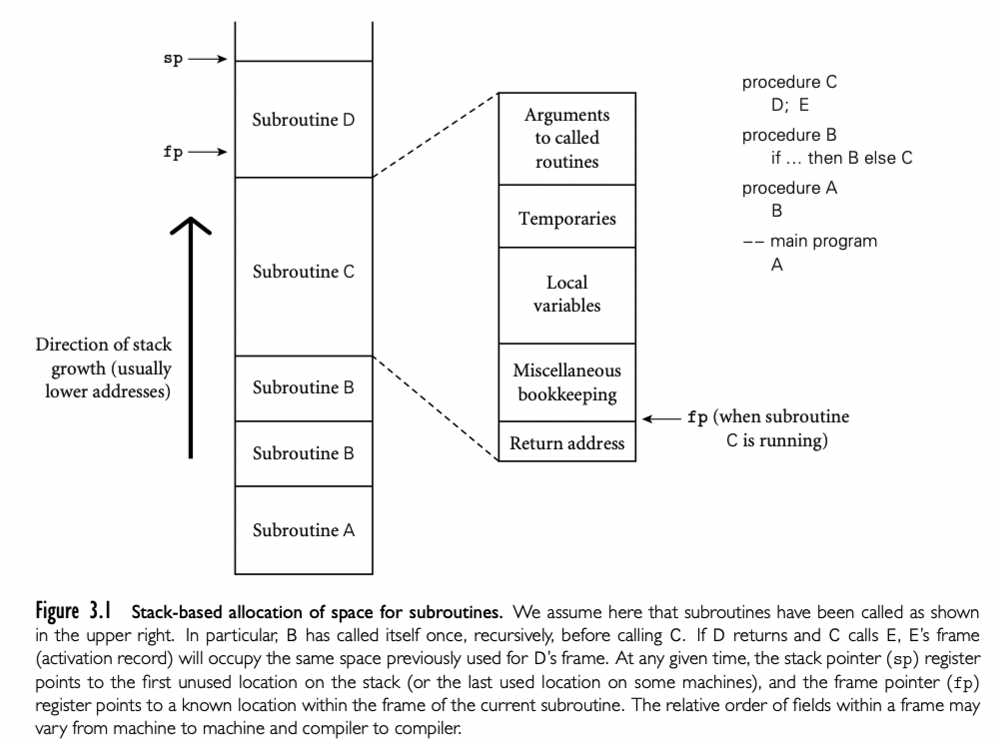
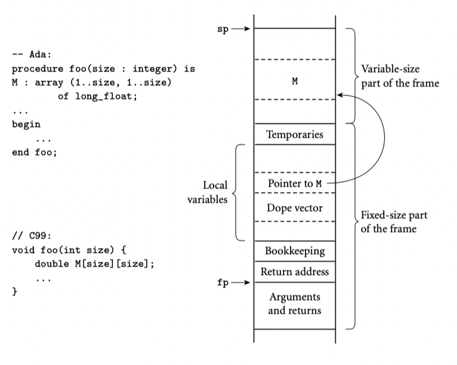
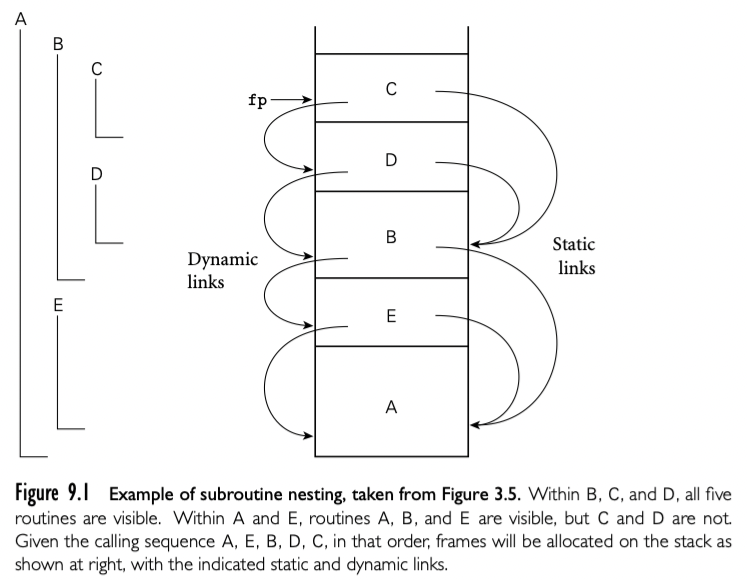

在 3.2.2 我们讨论了 subroutine 调用栈的空间分配（下图）。每个 routine 被调用，有一个新的 *stack frame*在栈顶。这个 frame 包含参数和返回值以及 bookkeeping 信息（包括返回地址以及保存的寄存器），局部变量，已经临时变量。当 subroutine return，frame 被推出栈。

任意给定的时间，*stack pointer* 寄存器都栈顶最后一个使用的地址或者第一个未使用的地址，具体取决于约定。*frame pointer* 寄存器包含 frame 内的地址。frame 内的对象通过 fp 的偏移访问。如果对象的大小在编译期未知，对象放在 frame 顶部可变的区域；它的地址和 dope vector 存储在 frame 的固定位置，fp 的固定偏移，如下图。如果没有可变大小的对象，frame 内的每个对象都有静态的已知 stack pointer 的偏移，并且实现可以不用 fp 寄存器，释放用于他用。如果参数的大小在编译期不知道，参数也要放在 frame 的可变区域。另外，caller 也可以简单的传递临时地址和 dope vector，并在被调用 routine 中复制到 frame 的可变区域。

静态 scope （Ada，Common Lisp，ML，Scheme，Swift）和嵌套 subroutine 的语言中，对象位于 subroutine 内，既不是局部也不是全局，可以建立静态链。每个 stack frame 包含一个引用，引用了 lexically surrounding subroutine 的 frame。这个引用叫做静态连接。类似的，fp 存储的值，在 subroutine 返回的时候会保存下来，叫做动态连接。静态连接和动态连接是否相同取决于当前的 routine 是否被 lexically surrounding routine 调用，或者被 surrounding routine 内的嵌套 routine。

