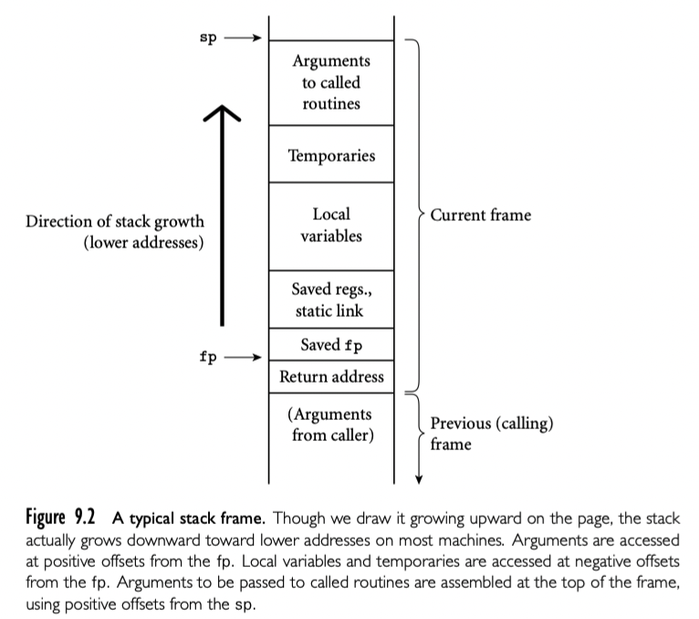

subroutine 的调用栈是 call sequence 维护的 -- caller 在 subroutine 执行前和执行后的要执行代码(prologue epilogue)。有时候术语 call sequence 用来指代 caller 操作，prologue, epilogue 的组合操作。

进入 subroutine 时必须要完成的任务包括传递参数，保存返回地址，改变程序计数器，改变分配空间的栈指针，保存寄存器（包括 frame 指针）其中callee 要用可能在 caller 也用的值，改变 frame 指针指向新的 frame，执行新 frame 需要对象的初始化操作。退出 subroutine 时必须完成的任务包括传递返回的参数或者返回值，执行需要析构的对象，释放栈 frame（恢复栈指针），恢复保存的寄存器（包括 frame 指针），恢复程序计数器。这些任务（比如传递参数）必须由 caller 执行。大多数任务可以 caller 或者 callee 执行。一般来说，如果 callee 执行尽可能多的任务，我们可以节省空间：callee 执行这些任务在目标程序中只出现一次，如果 caller 来每次调用都要执行一次，典型的 subroutine 调用会多次调用。

### Saving and Restoring Registers

保存寄存器中 division-of-labor 可能是最棘手的问题。最理想的方法是精确保存那些 caller 中使用，callee 中也要使用的寄存器。因为分离编译的问题，非常难确定相交集合。最简单的方法是保存所有 caller 的寄存器，或者保存 callee 中用的所有寄存器。

对于很多处理器按照 call sequence 约定，包括 ARM 和 x86，进行了折中：没有特殊目的的寄存器被分为两个几乎相等的集合。一个集合给 caller 用，另一个给 callee 用。就可以假定不会互相影响了。为了获得代码尺寸的收益，编译器尽可能使用 callee 寄存器保存局部变量和其他长时间存在的值。使用 caller 寄存器保存临时值不太需要跨调用存在。

### Maintaining the Static Chain

可嵌套 subroutine 的语言，至少简历 static chain 的工作需要 caller 来完成，因为这依赖于 caller 的 lexical 嵌套深度。标准方法是 caller 计算 callee 的 static link 然后作为隐藏的额外参数传递。两个子状况出现了：

1. callee 直接嵌套在 caller 内。这种情况，callee 的 static link 应该引用了 caller 的 frame。caller 因此可以传递自己的 frame 指针给 callee 的 static link
2. callee 更深的嵌套。这种情况，围绕 callee 的所有 scope 也是 caller 的（否则 callee 就不可见了）。caller 解引用 k 次 static link 然后传递结果给 callee 的 static link。

### A Typical Calling Sequence



上图展示了 stack frame 的合理布局。sp 指向第一个不用的地址（或者最后一个用的地址，取决于编译器和机器）。fp 指向 frame 底部。所有实参保存在 stack 中，即使编译器要使用寄存器传递它们。（callee 也需要标准空间存储它们，如果调用了嵌套 routine 还需要保存 static chain）

为了维护这种布局，call sequence 可能这样执行

caller 执行

1. 保存 caller 寄存器
2. 完成实参的计算，将值放入栈或者寄存器
3. 计算 static link（如果需要），作为额外的隐藏的参数传递
4. 使用特殊的 subroutine 调用指令跳转到 subroutine，通过寄存器或者栈传递返回地址

prologue，callee 执行：

1. 通过从 sp 减去适当值分配 frame
2. 保存旧的 frame 指针到栈中，更新成新的 frame
3. 保存所有的 callee 寄存器（包括 statik link ，返回地址）

subroutine 执行完后，epilogue

1. 移动返回值到寄存器或者栈中保留位置
2. 恢复 callee 保存的寄存器
3. 恢复 fp 和 sp
4. 跳到返回地址

最后，caller

1. 移动返回值到需要位置
2. 恢复 caller 保存的寄存器

### Special-Case Optimizations

通常情况下，call sequence ，prologue，epilogue 有些步骤可以忽略。如果硬件通过寄存器传递返回地址，leaf routine 可以留返回地址在那，不需要存到栈中。类似的不需要保存 static link 或者 caller 保存的寄存器。

不需要保存恢复局部变量的 subroutine 甚至在 RISC 机器上可以不需要 stack frame。最简单的 subroutine （比如库中标准算术计算函数）可能不需要访问内存：寄存器保存参数，不需要调用 routine，直接在寄存器计算，在寄存器返回结果。

## 9.2.1 Displays

static chain 的缺陷访问 k 次 scope 外需要解引用 k 次。如果局部对象可以加载到单独的寄存器（内存可以访问），k 层对象只需要 k + 1 次内存访问。使用 *display* 可以将次数减少到常数

display 就是一个小型数组代替 static chain。当然建立开销比 static chain 大，而且现代编译器可以很好的缓存 static chain 在寄存器中，以及 C 的继承者没有嵌套 subroutine 的特性，使得 display 用的并不多。

## 9.2.2 Stack Case Studies: LLVM on ARM; gcc on x86

call sequence 机器与机器，编译器与编译器各有不同。很多演进反映出寄存器用的越来越多，内存用的越来越少。这种演进反映了三种技术趋势：寄存器集合大小的提升，寄存器和内存速度差距的扩大，编译器和处理器重排指令获取性能提升的能力提升 -- 至少当所有操作都在寄存器时。

很多老编译器使用很少的寄存器，倾向于通过栈传递实参；更新的编译器，尤其是由更多寄存器集合的机器，倾向于使用寄存器传递实参。老架构倾向于将返回地址推入栈；更新的架构倾向于将返回地址放在寄存器中。

很多机器提供了特殊的指令来 subroutine-call sequence 使用。比如 x86 中，的 `enter leave ` 指令分配和释放 stack frame。ARM 上，`stm ldm`指令保存恢复寄存器组；常见的惯用法中，保存的集合包含返回地址（link register）；恢复集合包括程序技术器，`ldm`可以推出一组寄存器并使用单条指令从 subroutine 返回。

还有一个趋势，使用专用 frame 指针寄存器。老编译器中，对于老机器，更常见的使用 `push pop`指令来传递基于栈的实参。sp 值结果的不一致性是的寄存器访问局部变量更困难。分离的 frame 指针简化了代码生成和 symbol debugging。同时，引入了额外的指令到 subroutine call sequence，并减少了可用于其他目的寄存器的数量。现代编译器作者越来越喜欢权衡是否要为了性能提升复杂度，经常分离 fp，至少对于简单 routine。

## 9.2.3 Register Windows

对于 subroutine 调用返回时，保存/恢复寄存器，Berkeley RISC 机器提供了代替机制，称为 register windows。基本思想是映射 ISA 的寄存器名称有限集到更大的物理寄存器集合的某些子集（window），并在 subroutine 调用时改变映射。老映射和新映射重叠一小部分，允许实参使用交集传递。

## 9.2.4 In-Line Expansion

除了基于栈的调用约定，很多语言实现允许特定的 subroutine 在调用点扩展为内联。将 callee 复制到 caller 中，没有真实的 subroutine 调用发生。内联展开避免了一系列开销，包括空间分配，从调用到返回的延迟，建立 static chain，保存/恢复寄存器。也允许编译器进行代码优化，比如全局寄存器分配，指令调度，subroutine 之间的公共子表达式消除--大多数编译器不会这样做。

很多实现中，编译器按照约定选择那些内联展开。有些语言中，程序员可以指定哪些内联展开。在 C 和 C++ 中，关键字 `inline` 可以在函数声明前缀：

```cpp
inline int max(int a, int b);
```

在 3.7 中我们已经注意到内联展开和宏的相似性，但是前者从语义上更形式化。实际上，内联展开语义上是中性的：单纯是实现技术，没有对程序含义的影响。对比真实的 subroutine 调用，内联展开也有明显的缺点：代码膨胀。内联展开在 recursion subroutine 也不是可选的。比如：

```cpp
string fringe(bin_tree *t) {
  if (t->left == 0) return t->val;
  return fringe(t->left) + fringe(t->right);
}
```

编译器可以内联每个subroutine 调用时真实的调用。因为二叉树一半时叶子结点，这种展开会消除运行时一般的动态调用。递归函数内联有程度区分。（可以消除多少动态调用）

