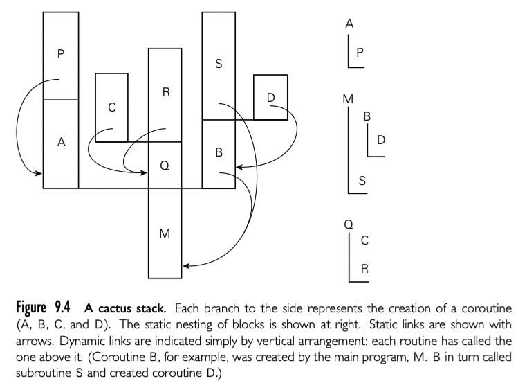

有了运行时栈的布局理解，我们可以考虑更加通用的控制抽象--coroutines。就像 consinuation, coroutine 也通过 closure 表征（代码地址，和关联的环境），我们可以通过 nonlocal goto 跳转，这种情况下，有一个特殊的操作 transfer。两个概念的主要不同点是: continuation 是常量，一旦创建不变，coroutine 每次运行都会改变。当 goto 到一个 continuation， 老的程序计数器被丢弃，除非我们显式创建一个新的 continuation 来持有。当使用 tranfer 从一个 coroutine 到另一个，我们老的程序计数器还是被存储着：我们离开的 coroutine 更新反映这个事实。因此，我们在同样的 continuation 多次执行 goto，每个 jump 都开始于同样的位置，但是如果在同样的 coroutine 执行 transfer 多次，每个 jump 从离开的位置执行。

实际上，coroutine 就是并发的执行上下文，但是同时只会执行一个，通过名字显式转移控制。coroutine 可以用来实现 iterator 和 thread。也有自己的用途，尤其是对于服务端和离散的事件模拟。历史上，线程出现可以追溯到 Algol 68。今天的 Ada，Java，C#，C++，Python，Ruby，Haskell，Go，Scala 等都有线程。几乎都在语言之外通过库提供。coroutine 不像用户层面的编程抽象。历史上，两个重要的语言提供了这种能力 Simula Modula-2。我们后面集中讨论的实现。以及 iterator 的应用和离散事件模拟。

一个简单的 coroutine 可能比较有用的例子，想象我们写一个屏保程序，大部分在屏幕上显示黑色，但是要保持图片移动，避免局部烧屏。想象我们的屏幕保护在后台对文件系统执行全局检查，寻找损坏文件，逻辑类似这样：

```c
loop 
  	-- update picture on screen
  	-- perform next sanity check
```

这个方法的问题是连续两次的 sanity 检查可能相互依赖。大多数系统中文件系统的检查代码是一个深度嵌套控制结构包含了很多循环。为了与屏幕更新程序解耦，程序员必须每次检查后保存嵌套计算的结果，并且在下次检查之前恢复该状态。

一种更吸引人的方法是将操作变为 coroutine：

```simula
us, cfs: coroutine
coroutine check_file_system()
	-- initialize
	detach 
	for all files
		...
		transsfer(us)
		...
			transfer(us)
		...
		transfer(us)
		...
coroutine update_screen()
	-- initialize
	detach 
	loop
		... 
		transfer(cfs)
		...
begin -- main
	us := new update_screen()
	cfs := new check_file_system()
	transfer(us)
```

语法绑定了 Simula。当第一次创建，coroutine 执行了一些必要的初始化操作，然后将自己从 main 程序中 detach 出来。detach 操作创建了一个 coroutine 对象可以稍后被 transfered，并返回这个 coroutine 的引用。这个 transfer 操作保存了当前程序计数器，并恢复指定参数的 coroutine。main 函数扮演了初始化，默认 coroutine 的角色。

从 check_file_system 中调用 transfer 可以出现在任意位置，包括嵌套循环和条件中。coroutine 可以调用 subroutine，也可以在 routine 中调用 transfer。程序下一次执行 sanity check 的上下文就被程序计数器保存下来。

在上面的例子中，coroutine 通过提供 transfer 操作使得程序员不需要显式指定什么时候切换上下文，以及显式保存/恢复寄存器操作。为了决定什么时候调用 transfer，我们必须同时考虑性能和正确性。对于性能来说，我们必须避免在调用之间做太多工作，导致屏幕更新频率更低。对于正确性来说，我们必须避免在检查的中间状态 transfer。parallel 线程可以消除第一个问题，通过确保屏幕更新程序定期接受处理器份额，但是会使得第二个问题复杂化：我们需要显式同步两个 routine。

## 9.5.1 Stack Allocation

因为是并发的（可能开始了但是没有结束），coroutines 不能分享单独的栈：作为整体来说，它们的 subroutine 调用和返回不遵守后进先出的顺序。大多数操作系统分配一个栈很容易。分配任意数量的栈不容易，从历史上看，coroutine 的空间至少在具有有限虚拟地址空间的机器上是一种实现挑战。

最简单的方法是给每个 coroutine 一个固定的静态分配的栈空间。如果运行时需要额外的空间就触发报错。如果没有用完就浪费掉。

如果栈 frame 在堆中分配，大多数函数式语言这样实现的，上面的问题没有了。但是开销提升了。这种的选择是将 stack 分配成固定尺寸的 chunk。每次调用，subroutine call sequence 检查当前 chunk 剩余的空间是否还够，如果不够，使用另一个 chunk。每次 subroutine 返回，epilogue 代码检查当前的 frame 是否在 chunk 中是最后的，如果是，chunk 变成可用状态。为了减少调用的开销，如果 subroutine 在返回之前不会 transfer，编译器可以使用原始的 stack。

如果 coroutine 可以嵌套创建，需用使用 cactus-stack 恢复



每个 stack 的分支包含了分离 coroutine 的 frame。【译者注：这有点没看懂，大概意思应该是嵌套 coroutine 类似嵌套 subroutine ，但是更复杂，需要什么样的数据结构来管理】

## 9.5.2 Transfer

为了使得从一个 coroutine 转移到另一个，运行时系统必须修改 PC，stack，处理器寄存器的内容。这些修改在 transfer 操作中保存。

所以如何修改栈？通常的做法是只修改栈指针寄存器，并避免在 transfer 中使用 fp。在 transfer 开始我们将所有 callee 保存的寄存器放到当前栈，以及返回地址。然后修改 sp，将新的返回地址和其他寄存器推出，然后返回：

```shell
transfer:
	push all registers other than sp(including ra)
	*current_coroutine := sp
	current_courinte := r1 -- argument passed to transfer
	sp := *r1
	pop all registers other than sp(including ra)
	return 
```

表示 coroutine 或者线程的数据结构被称为上下文块。简单的 coroutine 包中，上下文块只包含了一个值：sp。

## 9.5.3 Implementation of Iterators

略

## 9.5.4 Discrete Event Simulation 

略