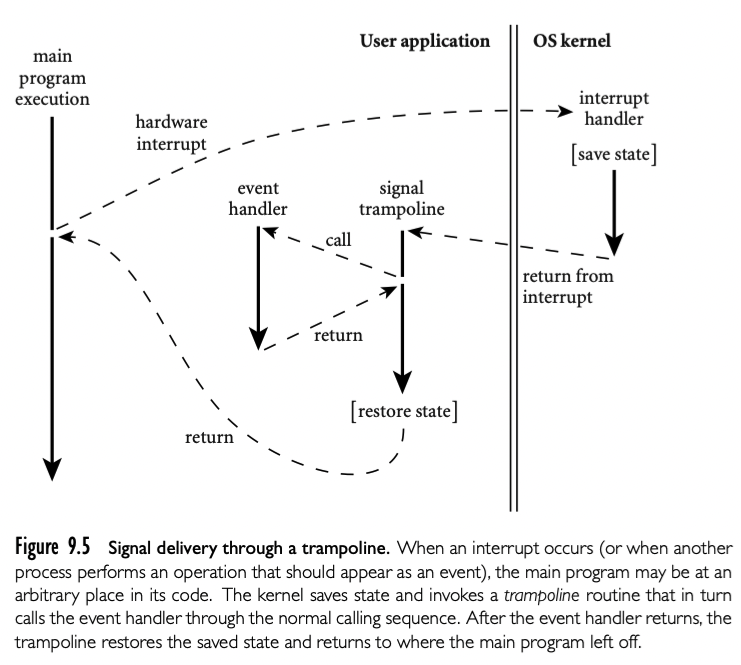

Events 是在不可预测的时间发生在程序之外但是需要响应的东西。通常由 GUI 系统发出：键盘，鼠标事件，按钮点击。也可能是网络操作或者其他异步 I/O 活动：消息到达，之前的磁盘请求操作完成。

在 8.7 中讨论的 I/O 操作，我们假定程序显式等待在输入位置直到完成。这种 synchronous 和 blocking 输入无法被 GUI 程序接受。程序员通常想要当event 出现一个 handler（一种特殊的 subroutine）被唤醒。handler 有时候也被称为 callback funcitons，因为运行时系统会回到主程序而不是从其调用。在面向对象语言中，callback function 可以是一些 handler 对象的方法，而不是静态的 subroutine。

## 9.6.1 Sequentail Handlers

传统上，event handler 在 sequential 编程语言中实现是“自然的” subroutine 调用，通常使用操作系统的定义和实现的机制，在语言本身之外。为了准备通过这种机制接收 event，程序调用 P -- 唤醒 setup_handler 库routine，传递给 subroutine 需要的监听的 event。

在硬件层面，异步设备在 P 的执行过程中活动被 interrupt 机制触发：保存 P 的寄存器，转到不同栈，跳到 OS 内核提供的地址。类似，如果当 interrupt 发生的时候有其他进程 Q 在执行，内核将会存储 P 的状态到它的最新时间片结尾。无论哪种方式，内核必须规划正确唤醒正确的 event handler，尽管 P 可能在无法正常发生的 subroutine 调用中。

这个图很好展示了整个过程。

实际上，大多数 event handlers 需要与主程序共享数据结构（否则，如何对 event 做一些有趣的响应？）。我们要保证 handler 与主主程序数据保持一致。需要同步机制，在 13 章详细讨论。

## 9.6.2 Thread-Based Handlers

在现代编程语言和运行时系统中，event 通常被单独的 thread 控制处理，而不是 subroutine 调用。使用单独的处理线程，输入又可以是同步的：处理线程通过系统调用请求下一个 event，等待其发生。同时主程序持续运行。如果程序希望并发处理多个 event，可以创建多个处理线程，每个线程通过系统调用等待 event。为了保护共享数据，主程序和处理线程通常需要同步机制。

很多现代 GUI 系统就是基于线程的，尽管有些只有一个处理线程。OpenGL Utility Toolkit(GLUT), GNU Image Manipulation Program(GIMP) Tool Kit(Gtk), JavaFX 库，.NET Windows Presentation Foundation(WPF) 都是例子。

handler 执行的动作需要简洁，从而 handler 线程可以重新调用内核等待下一个 event。如果 handler 执行耗时很长，用户就会发现应用没有响应。如果 event 需要启动计算要求的内容，或者需要执行其他 I/O，则 handler 需要创建一个新线程来完成，或者可以将请求传递给其他工作线程。